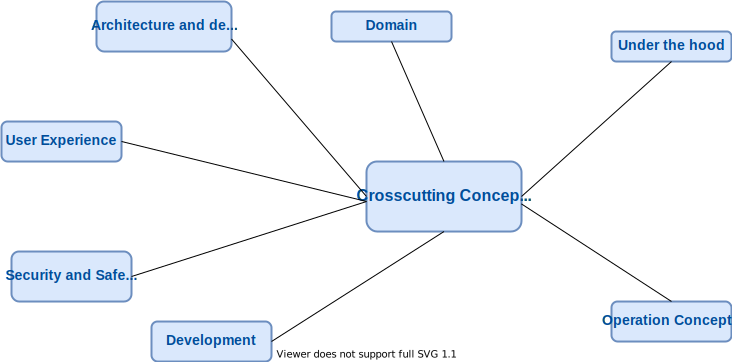

# Crosscutting Concepts

## Domain concepts

- [WikibaseDataModel](https://github.com/wmde/WikibaseDataModel)
- [WikibaseDataModelJavaScript](https://github.com/wmde/WikibaseDataModelJavaScript)
- [WikibaseDataModelTypes](https://github.com/wmde/WikibaseDataModelTypes)

You can read more about Wikibase's data model in the [Glossary](./Glossary.md#entity).

## User Experience concepts (UX)

### User Interface

User interfaces which were build prior to 2017 use either [OOUI](https://www.mediawiki.org/wiki/OOUI) or [jQuery UI](https://jqueryui.com).  
[OOUI](https://www.mediawiki.org/wiki/OOUI) is a MediaWiki core library (developed and supported by the WMF) that contains a set of ready-to-use widgets, layouts, windows and a server-side component that generates compatible output in PHP for cases where JavaScript is not supported.

There are several applications which are written in [Vue](https://vuejs.org/) and [TypeScript](https://www.typescriptlang.org/).  
JavaScript and CSS dependencies are managed through npm. Optimization and minification of files is done through [Webpack](https://v4.webpack.js.org/).  
There is a central Vue components library in development as part of the [Wikidata/Wikibase Design System](https://wmde.github.io/wikit/). In the future, ideally, all frontend components will be using it.

The project Termbox, which delivers the terms section of an item page on mobile, uses Vue and [vue-server-renderer](https://www.npmjs.com/package/vue-server-renderer) to achieve [server side rendering](https://wikitech.wikimedia.org/wiki/WMDE/Wikidata/SSR_Service).

### Internationalization (i18n)

The system is made usable in international settings in the following ways:

- by providing internationalized content via [mediawiki's i18n mechanism](https://www.mediawiki.org/wiki/Localisation)
- by designing and developing for both left-to-right and right-to-left scripts

## Security concepts

The development conforms to established [security best practices](https://www.mediawiki.org/wiki/Security_for_developers).

Security code review is performed by [WMF's Security Team](https://www.mediawiki.org/wiki/Wikimedia_Security_Team) for every new feature.

## Architecture and design patterns

Recurring patterns within the system.  
TBD

## “Under-the-hood” concepts

### Persistency

How / where to store and retrieve data.  
TBD

### Process control

TBD

### Communication and integration

How to integrate with other systems, how to communicate (i.e. sync, async, pub-sub…)  
TBD

### Exception and error handling

What errors to handle, how to handle exceptional situations.  
TBD.

### Parallization and threading

How to parallelize tasks, how to create/spawn/manage processes.  
TBD.

### Plausibility checks and validation

i.e. client-side validation, how to verify/check data, input, results.  
TBD.

### Business rules

i.e. how to use a rule-engine, how to implement/configure business rules, how to change those…  
TBD.

### Batch processing

How to process data in batches (i.e. offline processing).  
TBD.

### Reporting

How to create reports, how to gather the required data, how to render the results.  
TBD.

## Development concepts

### Build, test, deploy

TBD

### Code generation

TBD

### Migration

TBD

### Configurability

TBD

## Operational concepts

### Administration

TBD

### Management

TBD

### Disaster-Recovery

TBD

### Scaling

TBD

### Clustering

TBD

### Monitoring, Logging

TBD

### High Availability

TBD

### Load balancing

TBD
