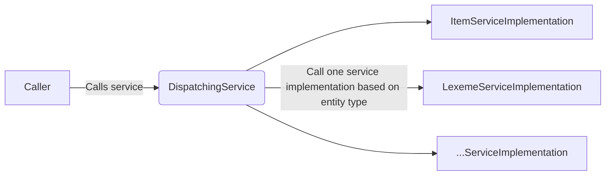

# Crosscutting Concepts

## Domain concepts

- [WikibaseDataModel](https://github.com/wmde/WikibaseDataModel)
- [WikibaseDataModelJavaScript](https://github.com/wmde/WikibaseDataModelJavaScript)
- [WikibaseDataModelTypes](https://github.com/wmde/WikibaseDataModelTypes)

You can read more about Wikibase's data model in the [Glossary](./Glossary.md#entity).

## User Experience concepts (UX)

### User Interface

User interfaces which were built prior to 2017 use either [OOUI](https://www.mediawiki.org/wiki/OOUI) or [jQuery UI](https://jqueryui.com).

There are several applications which are written in [Vue](https://vuejs.org/) and [TypeScript](https://www.typescriptlang.org/).\
JavaScript and CSS dependencies are managed through npm. Optimization and minification of files is done through [Webpack](https://v4.webpack.js.org/).\
There is a central Vue components library in development as part of the [Wikidata/Wikibase Design System](https://wmde.github.io/wikit/). In the future, ideally, all frontend components will be using it.

The project Termbox, which delivers the terms section of an item page on mobile, uses Vue and [vue-server-renderer](https://www.npmjs.com/package/vue-server-renderer) to achieve [server side rendering](https://wikitech.wikimedia.org/wiki/WMDE/Wikidata/SSR_Service).

### Internationalization (i18n)

The system is made usable in international settings in the following ways:

- by providing internationalized content via [mediawiki's i18n mechanism](https://www.mediawiki.org/wiki/Localisation)
- by designing and developing for both left-to-right and right-to-left scripts

## Security concepts

The development conforms to established [security best practices](https://www.mediawiki.org/wiki/Security_for_developers).

Security code review is performed by [WMF's Security Team](https://www.mediawiki.org/wiki/Wikimedia_Security_Team) for every new feature.

## Architecture and design patterns

Recurring patterns within the system.

### Dispatching

Wikibase, particularly [Wikibase Repository](./systems/Repository/01-Introduction.md) and [Wikibase Client](./systems/Client/01-Introduction.md), make use of a [Dynamic Dispatch](https://en.wikipedia.org/wiki/Dynamic_dispatch#Single_and_multiple_dispatch) pattern.
This is most notably used for switching internal service implementations based on the [type of entity](./Glossary.md#entity-types) being interacted with.

A few different implementations of the dispatching pattern currently exist, the most notable difference being:

- Default / fallback implementation available in some implementations
- Callbacks that act as factory methods passed into dispatching code, rather than concrete implementations (see Wikibase's [Topics/EntityTypes](https://doc.wikimedia.org/Wikibase/master/php/md_docs_topics_entitytypes.html))
- Multiple implementations able to be called for a single entity type

## “Under-the-hood” concepts

### Persistency

How / where to store and retrieve data.\
TBD

### Communication and integration

How to integrate with other systems, how to communicate (i.e. sync, async, pub-sub…)\
TBD

## Development concepts

### Build, test, deploy

Common tool chains, and patterns.
TBD.

### Configurability

Aim of having white label services, for generic Wikibase usage.
TBD.
