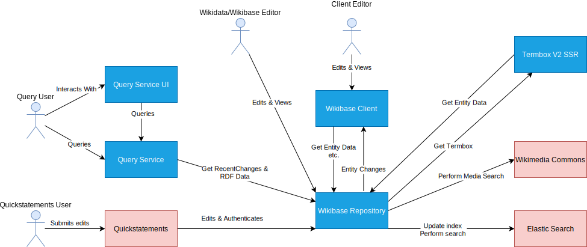

# Context and Scope

## Business Context

| Subsystem                                                                  | Responsibility                                                |
| -------------------------------------------------------------------------- | ------------------------------------------------------------- |
| [Wikibase Repository](./systems/WikibaseRepo/01-Introduction_and_Goals.md) | Data Repository                                               |
| [Wikibase Client](./systems/WikibaseClient/01-Introduction_and_Goals.md)   | Access view MediaWiki to a Data Repository                    |
| Query Service                                                              | Graph representation of Wikibase data with a SPARQL interface |
| Query Service UI                                                           | User interface for a SPARQL interface                         |
| Elastic Search                                                             | Indexes MediaWiki / Wikibase for search pourposes             |
| Wikimedia Commons                                                          | A source of media files for Wikibase                          |
| Quickstatements                                                            | A tool enabling mass editing of Wikibase Entities             |

## Technical Context

:::warning

This diagram is not an ideal representation of the technical context, and will be improved in time.

You may find that the individual Wikibase Repository and Wikibase Client components documentations are more helpful

:::

Wikibase extensions, containing [Wikibase Repository](./systems/WikibaseRepo/01-Introduction_and_Goals.md), [Wikibase Client](./systems/WikibaseClient/01-Introduction_and_Goals.md) and more.

