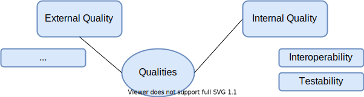

# Quality Requirements

## Quality Tree

## Internal Quality Scenarios

### Testability

The PHP code is covered by integration and unit tests in [PHPUnit](https://phpunit.readthedocs.io/en/9.5/).  
Tha JavaScript, TypeScript and Vue code is covered by unit, integration and e2e tests in [Jest](https://jestjs.io/docs/en/getting-started.html).  
UIs such as Data Bridge are covered by browser tests via [wdio](https://webdriver.io/docs/gettingstarted).

Test coverage statistics for Data Bridge are provided via Jest but that functionality does not run on CI.  
Test coverage for PHP code is measured via [SonarQube](https://www.sonarqube.org/)

### Interoperability

Wikibase Client provides several Action API modules. For more info see the [API Building Blocks section](./05-Building_Block_View.md#apis).  
Wikibase Client also provides the so called Special Pages. For more see the [Special Pages Building Blocks section](./05-Building_Block_View.md#special-pages).
