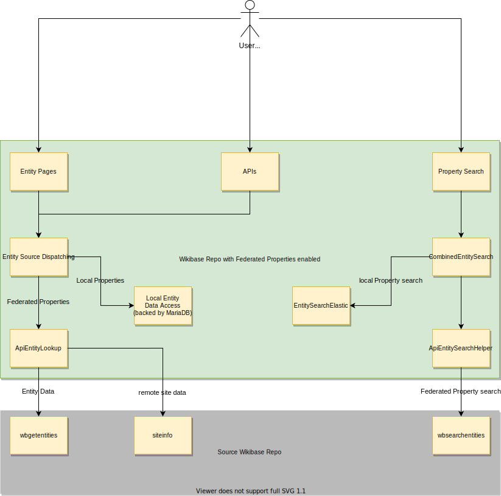

# Context and Scope

## Technical Context

| Component                    | Description                                                                                                                                                                                                                   |
| ---------------------------- | ----------------------------------------------------------------------------------------------------------------------------------------------------------------------------------------------------------------------------- |
| User of a 3rd-party Wikibase | Person/bot/application interacting with the Wikibase instance's UI or APIs                                                                                                                                                    |
| Entity Pages                 | Pages showing structured [Entity](../../Glossary.md#entity) data of Entities stored in the local Wikibase Repository                                                                                                          |
| APIs                         | This includes API endpoints that may contain or use (but not modify!) Federated Properties                                                                                                                                    |
| Property Search              | Search for [Properties](../../Glossary.md#property) via the search bar, the Property input when adding a [Statement](../../Glossary.md#statement), or directly via the API                                                    |
| Entity Source Dispatching    | Mechanism for choosing a data-access mechanism based on an Entity ID. See [ADR 21](https://doc.wikimedia.org/Wikibase/master/php/adr_0021.html).                                                                              |
| CombinedEntitySearchHelper   | Combines search result from two sources                                                                                                                                                                                       |
| EntitySearchElastic          | Search for local Entities, backed by ElasticSearch                                                                                                                                                                            |
| ApiEntityLookup              | Looks up Entities from a remote Wikibase via HTTPS                                                                                                                                                                            |
| ApiEntitySearchHelper        | Search for Entities from a remote Wikibase                                                                                                                                                                                    |
| wbgetentities                | API endpoint for reading the data for multiple Wikibase Entities                                                                                                                                                              |
| siteinfo                     | API endpoint for getting meta information of a wiki, which is used by Federated Properties e.g. to find out the Property namespace for generating links. See also [API:Siteinfo](https://www.mediawiki.org/wiki/API:Siteinfo) |
| wbsearchentities             | API endpoint for searching Entities                                                                                                                                                                                           |
