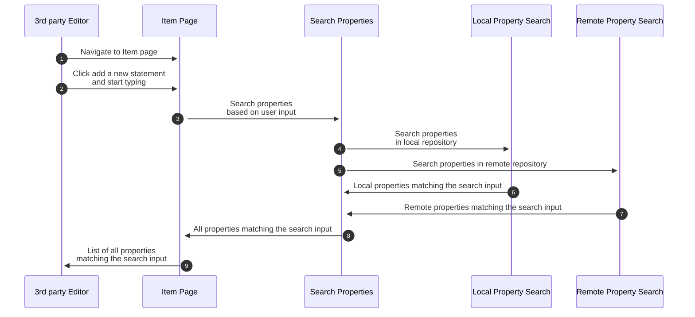

# Runtime View

See [3rd party Editor's use case](../Repository/01-Introduction.md#3rd-party-editor): _Extend a non Wikimedia Wikibase with relevant entities from Wikidata_

## Listing federated and local properties in a local Item's statement edit view

