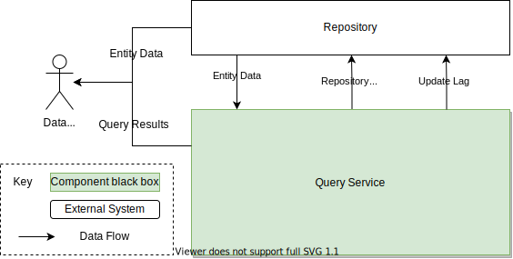
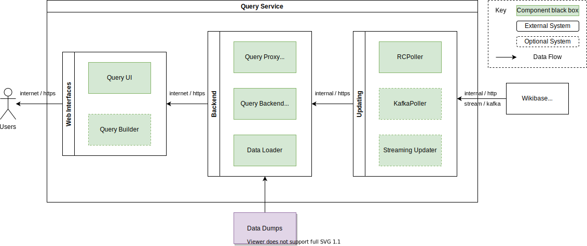

# Context and Scope

## Business Context

| Neighbour  | Description                            |
| ---------- | -------------------------------------- |
| Repository | The source of data that can be queried |

## Technical Context

The query service is made up of a set of components, which all surround a core [Blazegraph](./../../Glossary.md#blazegraph) powered [SPARQL](./../../Glossary.md#sparql) backend.

::: warning
This does not currently reflect the current Wikdiata production deployment of the Query Service.
:::

| Component     | Description |
| ------------- | ----------- |
| Query UI      | TBA         |
| Query Builder | TBA         |
| Query Proxy   | TBA         |
| Query Backend | TBA         |
| Query Updater | TBA         |
