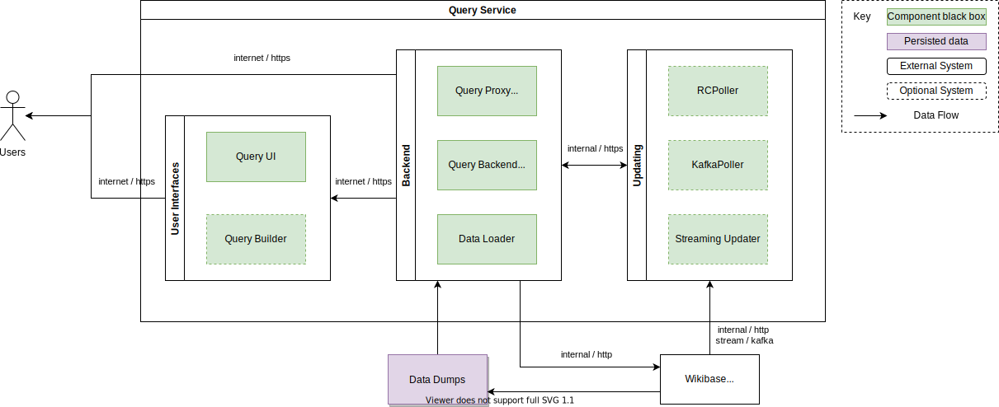

# Context and Scope

## Business Context

| Neighbour  | Description                            |
| ---------- | -------------------------------------- |
| Repository | The source of data that can be queried |

## Technical Context

The query service is made up of a set of components, which all surround a core [Blazegraph](./../../Glossary.md#blazegraph) powered [SPARQL](./../../Glossary.md#sparql) backend.

The components can be deployed in mutliple configurations.

| Component              | Description                                                                                                                                                |
| ---------------------- | ---------------------------------------------------------------------------------------------------------------------------------------------------------- |
| Query Frontend (UI)    | Provides a user interface for making SPARQL queries and visualizing data.                                                                                  |
| Query Builder          | Provides a user interface for generating lists from SPARQL queries.                                                                                        |
| Query Proxy            | Sitting infront of the Backend for user access to the [SPARQL](./../../Glossary.md#sparql) API.                                                            |
| Query Backend          | Persistence in a modified version of [Blazegraph](./../../Glossary.md#blazegraph).                                                                         |
| Query Updater          | Taking changes from a source (either [Wikibase Repository](./../../Glossary.md#wikibase-repository) or Kafka) and writing them to the backend persistence. |
| Query Steaming Updater | Turns a stream of edit events into a stream of RDF changes                                                                                                 |
