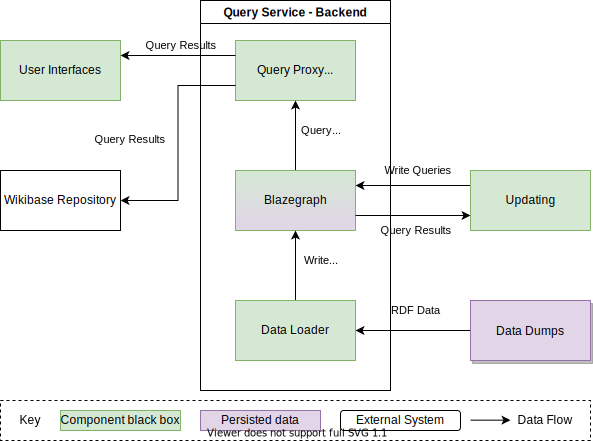
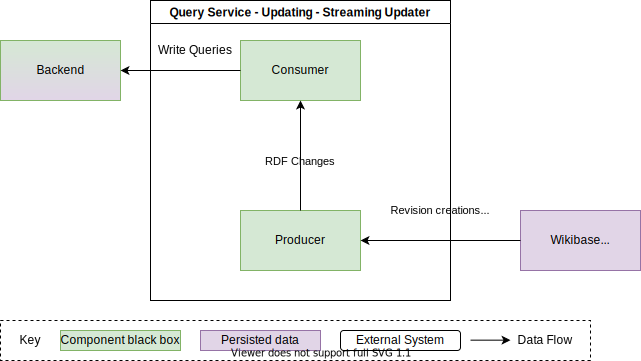

# Building Block View

## Overall System

The Query Service is made up of a few failry distinct components.

| Building Block                    | Responsibility                                                         |
| --------------------------------- | ---------------------------------------------------------------------- |
| [Web Interfaces](#web-interfaces) | Allow user interaction with the Query Service via UIs                  |
| [Backend](#backend)               | Index data and serve SPARQL queries                                    |
| [Updating](#updating)             | Keeping the Backend up to date with changes from a Wikibase Repository |

## Web Interfaces

| Building Block | Responsibility                                                                                |
| -------------- | --------------------------------------------------------------------------------------------- |
| Query Frontend | Provide users with an interface to create entirly custom SPARQL queries and visualize results |
| Query Builder  | Provider users with a simple visual interface for generating lists using the query service    |

## Backend

| Building Block           | Responsibility                                                                                                                                                |
| ---------------------- | ---------------------------------------------------------------------------------------------------------------------------------------------------------- |
| Query Proxy | Force setting of timeouts, read only queries and basic caching |
| Blazegraph | Graph datagbase with a SPARQL API |

## Updating

| Building Block                          | Responsibility                                                                           |
| --------------------------------------- | ---------------------------------------------------------------------------------------- |
| [Streaming Updater](#streaming-updater) | Updating Blazegraph using a stream of RDF change events                                  |
| Updater                                 | Updating Blazegraph using a stream of revision creation events, or polling RecentChanges |

### Streaming Updater

| Building Block | Responsibility                                                                   |
| -------------- | -------------------------------------------------------------------------------- |
| Consumer       | Consumes a stream of RDF changes and writes them to Blazegraph                   |
| Flink          | Consumes a stream of revision creation events, and emits a stream of RDF changes |
