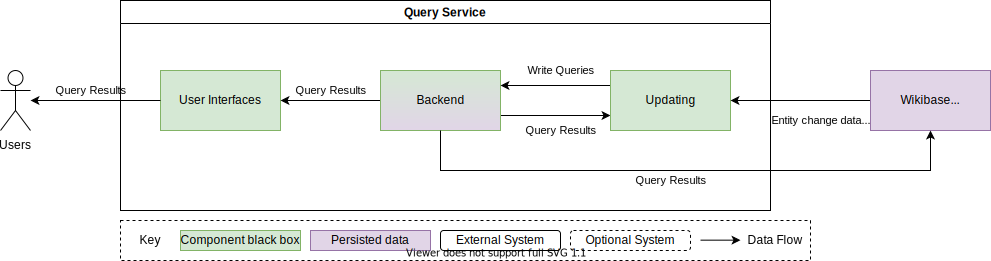
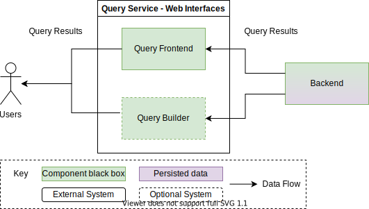
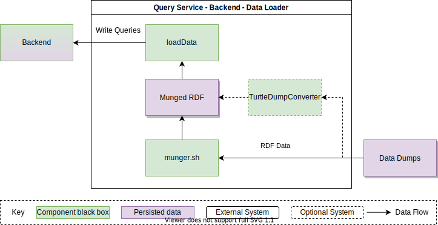
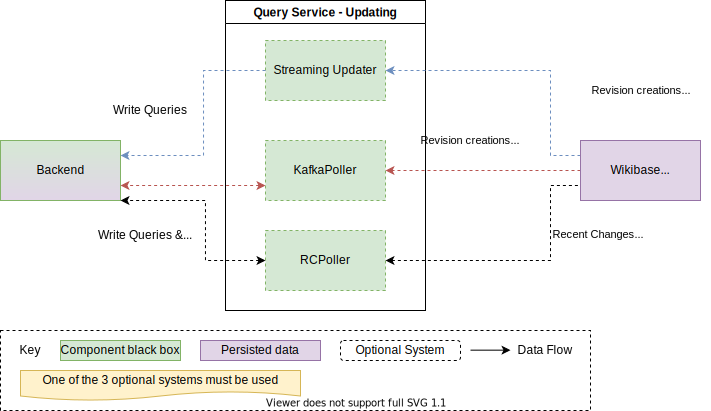

# Building Block View

## Overall System

The Query Service is made up of a few fairly distinct components.

| Building Block                      | Responsibility                                                         |
| ----------------------------------- | ---------------------------------------------------------------------- |
| [User Interfaces](#user-interfaces) | Allow user interaction with the Query Service via UIs                  |
| [Backend](#backend)                 | Index data and serve [SPARQL](./../../Glossary.md#sparql) queries      |
| [Updating](#updating)               | Keeping the Backend up to date with changes from a Wikibase Repository |

## User Interfaces

| Building Block | Responsibility                                                                                                              |
| -------------- | --------------------------------------------------------------------------------------------------------------------------- |
| Query Frontend | Provide users with an interface to create entirly custom [SPARQL](./../../Glossary.md#sparql) queries and visualize results |
| Query Builder  | Provider users with a simple visual interface for generating lists using the query service                                  |

## Backend

| Building Block | Responsibility                                                  |
| -------------- | --------------------------------------------------------------- |
| Query Proxy    | Force setting of timeouts, read only queries and basic caching  |
| Blazegraph     | Graph datagbase with a [SPARQL](./../../Glossary.md#sparql) API |
| Data Loader    | Loads data into Blazegraph from an RDF rump                     |

### Data Loader

The Data Loader currently currently exists in 2 different flavours, which are used in difference deployments.
Only 1 of the choices for munging / RDF conversation is needed per deployment.

| Building Block      | Responsibility                                                                                                                                             |
| ------------------- | ---------------------------------------------------------------------------------------------------------------------------------------------------------- |
| loadData            | Load [RDF](./../../Glossary.md#rdf) into Blazegraph                                                                                                        |
| munger              | Convert Wikibase Repository [RDF](./../../Glossary.md#rdf) triples into different triples for Blazegraph                                                   |
| TurtleDumpConverter | Convert Wikibase Repository [RDF](./../../Glossary.md#rdf) triples into different triples for Blazegraph in a [Hadoop](./../../Glossary.md#hadoop) cluster |

## Updating

The Updating system curently exists in 3 different flavours, which are used in different deployments.
Only 1 of these update paths is needed in each deployment.

| Building Block                          | Responsibility                                                                                                                           |
| --------------------------------------- | ---------------------------------------------------------------------------------------------------------------------------------------- |
| [Streaming Updater](#streaming-updater) | Updating Blazegraph using a stream of [RDF](./../../Glossary.md#rdf) change events                                                       |
| KafkaPoller                             | Updating Blazegraph using a stream of events created by [EventBus](./../../Glossary.md#eventbus) from [Kafka](./../../Glossary.md#kafka) |
| RCPoller                                | Updating Blazegraph by polling [Recent Changes](./../../Glossary.md#recent-changes) for new changes                                      |

### Streaming Updater

| Building Block | Responsibility                                                                                                                                              |
| -------------- | ----------------------------------------------------------------------------------------------------------------------------------------------------------- |
| Consumer       | Consumes a stream of [RDF](./../../Glossary.md#rdf) changes and writes them to Blazegraph                                                                   |
| Producer       | Consumes a stream of events from MediaWiki (Revision creations, Page deletions / undeletions), and emits a stream of [RDF](./../../Glossary.md#rdf) changes |
