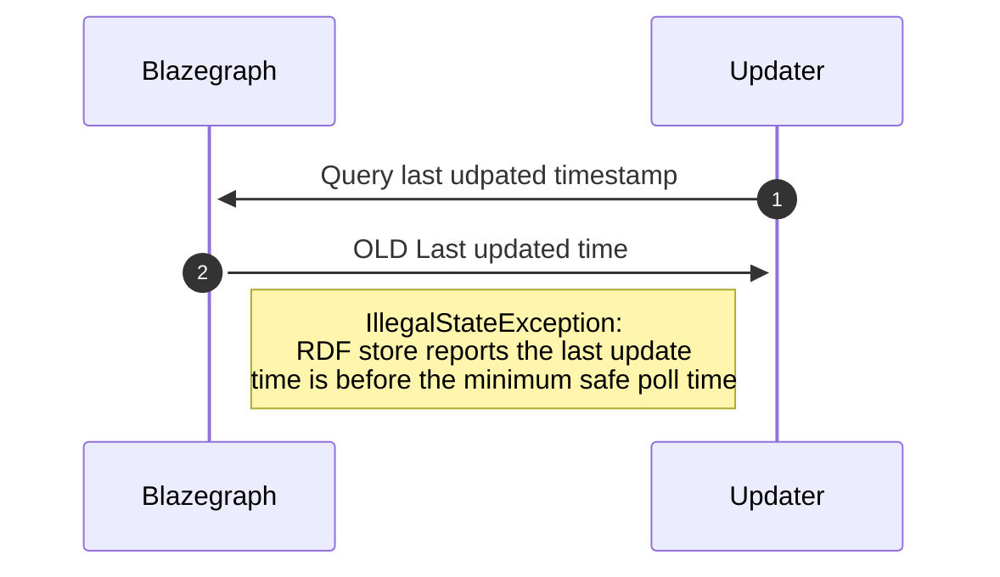

# Runtime View

## Updater

A happy path when updating happens.

A common error case for infrequently edited wikis is when the storage timestamp in Blazegraph appears to be too old.

<https://phabricator.wikimedia.org/T182394>

