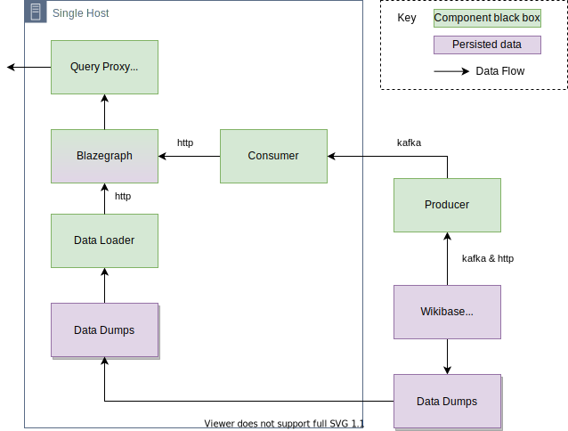
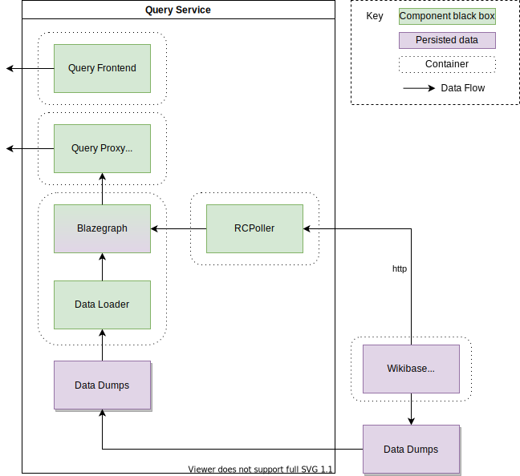

# Deployment View

## Wikidata.org

[Wikidata.org](./../../Glossary.md#wikidata) is the largest deployment of the Query Service.
It makes use of the Streaming Updater, and runs on multiple servers, in multiple distinct groups, in multiple data centres hosted by the Wikimedia Foundation.

Canonical documentation:

- [Wikidata Query Service deployment page](https://wikitech.wikimedia.org/wiki/Wikidata_Query_Service)
- [Wikimedia Event Platform](https://wikitech.wikimedia.org/wiki/Event_Platform)

### Multi Cluster

### Single Host

Each server in this setup runs the Streaming Updater Consumer, getting a stream of RDF changes from Kafka, that have been created by a single Streaming Updater Producer.

### User Interfaces

User Interfaces are deployed to [Microsites](https://wikitech.wikimedia.org/wiki/Microsites) infrastructure.

[Wikitech documentation exists for this deployment](https://wikitech.wikimedia.org/wiki/Microsites#Wikidata_Query_Service_(UIs)).

The application is built by Jenkins and committed to a new Git repository, which is then deployed ot Microsites.

## Wikibase Docker

Wikibase docker releases, and the suggested 3rd party deployments make use of the older Recent Changes based updater.

Containers can be deployed in any number of ways.

The docker-compose example would result in these containers all being within the same host machine.

## Wikibase as a Service

[Wikibase as a service](./../../Glossary.md#wikibase-as-a-service) uses custom services to fullful some specific needs for its deployment of the Query Service.

Most notably the `query-gateway` and custom `query-updater`.

Canonical documentation:

- [WBStack Queryservice tech docs](https://wbstack.github.io/docs/tech/services/queryservice.html)

