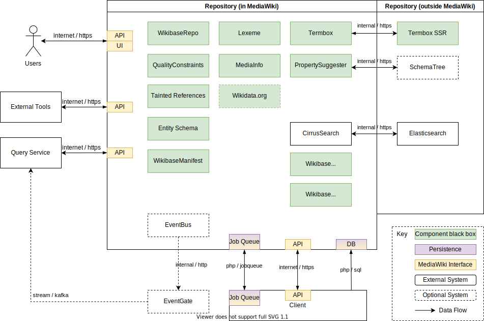

# Context and Scope

## Business Context

**Editor**

A Wikibase editor will create, reads, updates, deletes, monitors and maintains structured data on a Repository.

**Data Re-user**

A Data Re-user will access data from a Repository directly, but also via the Query Service to visualize and deepdive.

**Importer**

Importers will use external tools, or a Repository directly to import large ammounts of data.

**Query Service**

The Query Service stores a current version of all data held in the Repository allowing Data Re-users to query it using SPARQL or user interfaces.

**External Tools**

External tools make use of any availible public entrypoint to interact with the data heald within a Repository.

**Client**

Client connects to a Repository, using its data in MediaWiki pages and connecting pages to Repository Items.
A Client will notify a Repository if things happen on it that the Repository might care about, such as page renames or deletions.

**Repository**

The Reposiotry holds the canonical source of truth for structured data.
It provides a variety of public and non public interfaces to create, reads, updates, deletes, monitors and maintain this data.

## Technical Context

Many repo components exists within MediaWiki as extensions.
Their connection to MediaWiki is not represented to keep things simple.

**internet / https**

APIs and UIs provided by MediaWiki that Repository adds features to are contactable over the internet via https.

Both users and other systems use these APIs.

The Query Service has a SPARQL API that Repository queries in some cases.

**php / sql**

Client pulls data from the Repository directly from the SQL database using a connection in PHP and shared PHP data access code.

**php / job queue**

Both Repository and Client have MediaWiki job queues, and they both "send messages" via these job queues.

## Deepdive Context

::: warning
This is not a complete picture
:::

While we were still figuring out how to use the arc42 documentation model lots of diagrams were created.
The diagram below was "technical context" but probably goes too deep, but is kept here for reference until its content is represented elsewhere (mostlikely in building block views)

Wikibase Repository is being developed as a set of MediaWiki extensions, but unlike Wikibase Client, they are not "plugins" that live inside MediaWiki, adding functionality to it. Instead, Wikibase Repository should be considered a system of its own, which is reflected in this diagram by not regarding MediaWiki as an external system to Wikibase Repository. See further details on this decision in the [Solution Strategy](04-Solution_Strategy.md#developing-wikibase-repository-through-mediawiki-extensions) section.

::: tip
Note that updates to the Query Service from the Repository will use either Recent Changes or the event stream via EventLogging and EventGate, not both. Wikidata uses the event stream, while most third party Wikibase setups use an updater that polls the Recent Changes page.
:::

| Component                                                                 | Description                                                                                                                                       |
| ------------------------------------------------------------------------- | ------------------------------------------------------------------------------------------------------------------------------------------------- |
| Entity UI and Special Pages                                               | These are the main web user interfaces for viewing and editing [Entity](../../Glossary.md#entity) data                                            |
| Dump Generation                                                           | Generates various formats of data dump from the Repo's [Entities](../../Glossary.md#entity)                                                       |
| [MW Recent Changes](https://www.mediawiki.org/wiki/Help:Recent_changes)   | A MediaWiki page listing the most recent edits                                                                                                    |
| [MW EventLogging](https://www.mediawiki.org/wiki/Extension:EventLogging)  | Backend-agnostic logs of structured event data                                                                                                    |
| [EventGate](https://wikitech.wikimedia.org/wiki/Event_Platform/EventGate) | An EventLogging backend which in production is backed by Kafka                                                                                    |
| Repo DB                                                                   | The SQL database containing [Entity](../../Glossary.md#entity) data                                                                               |
| Data Dumps                                                                | Data dump artifacts, in a variety of formats                                                                                                      |
| Entity edit hooks                                                         | Hooks that get triggered when an [Entity](../../Glossary.md#entity) is edited                                                                     |
| UpdateRepo                                                                | Updates [Sitelinks](../../Glossary.md#sitelink) when the sitelink target is moved or deleted on the Wikibase Client                               |
| API                                                                       | The Repository's actions on the [MW Action API](https://www.mediawiki.org/wiki/API:Main_page) for editing Entities and reading Entity (meta) data |
| PropertySuggester                                                         | An extension to provide suggested properties when a user tries to add new statements to an item                                                   |
