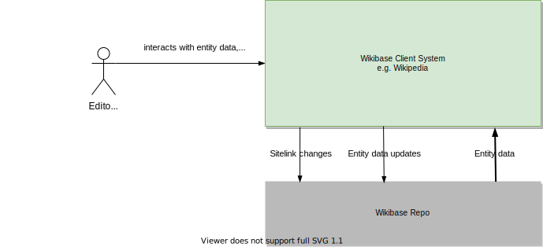
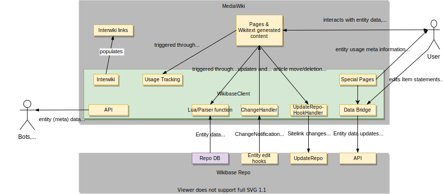

## Context and Scope

### Business Context

| Neighbour     | Description                                                                                         |
| ------------- | --------------------------------------------------------------------------------------------------- |
| User          | A user focused on the Client site (Wikipedia, Wikivoyage, ...), such as a reader or editor          |
| Wikibase Repo | A [Wikibase Repository](../overview/12-Glossary.md#wikibase-repository) that the Client connects to |

### Technical Context

WikibaseClient is a "plugin" (= extension) that lives inside [MediaWiki](../overview/12-Glossary.md#mediawiki) and adds functionality to it, which is reflected in this context diagram by embedding the WikibaseClient subsystem into a higher-level MediaWiki application. See further details on this decision in the [Solution Strategy](04-Solution_Strategy.md#developing-wikibase-client-as-a-mediawiki-extension) section.

| Component                                                                     | Description                                                                                                                                                                                                   |
| ----------------------------------------------------------------------------- | ------------------------------------------------------------------------------------------------------------------------------------------------------------------------------------------------------------- |
| [Lua/Parser function](./05-Building_Block_View.md#entity-data-access)         | [Lua bindings](../overview/12-Glossary.md#lua) or parser functions invoked through [Wikitext](../overview/12-Glossary.md#wikitext) to embed [Entity](../overview/12-Glossary.md#entity) data in Wiki articles |
| [ChangeHandler](./05-Building_Block_View.md#entity-change-notifications)      | Receives notifications to update and purge pages when an Item is changed on the [Repo](../overview/12-Glossary.md#wikibase-repository)                                                                        |
| [UpdateRepoHookHandler](./05-Building_Block_View.md#linked-site-page-changes) | Notifies the [Repo](../overview/12-Glossary.md#wikibase-repository) to update the connected Item when a page is moved or deleted                                                                              |
| [Data Bridge](./05-Building_Block_View.md#client-side-item-edits)             | A frontend component enabling [Repo](../overview/12-Glossary.md#wikibase-repository) edits on the Client via the Repo API                                                                                     |
| [Special Pages](./05-Building_Block_View.md#special-pages)                    | User interfaces for viewing Entity meta data                                                                                                                                                                  |
| [APIs](./05-Building_Block_View.md#apis)                                      | WikibaseClient's actions on the [MW Action API](https://www.mediawiki.org/wiki/API:Main_page) exposing Entity (meta) data                                                                                     |
| [Usage Tracking](./05-Building_Block_View.md#usage)                           | Tracks which Repository [Entities](../overview/12-Glossary.md#entity) are referenced on which wiki pages, and how.                                                                                            |
