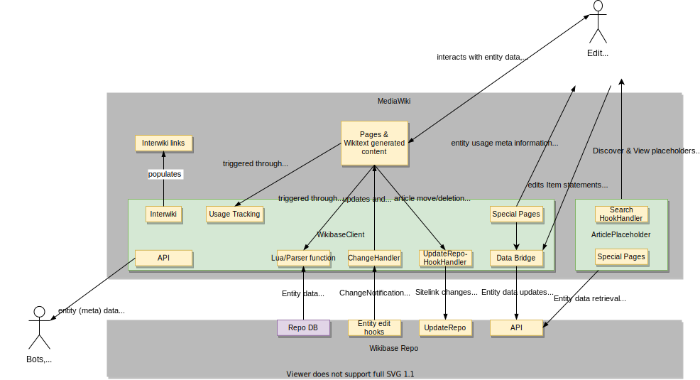

## Context and Scope

### Business Context

| Neighbour     | Description                                                                                |
| ------------- | ------------------------------------------------------------------------------------------ |
| Wikibase Repo | A [Wikibase Repository](../../Glossary.md#wikibase-repository) that the Client connects to |

### Technical Context

Wikibase Client is implemented as a collection of [MediaWiki extensions](../../Glossary.md#mediawiki-extension).
These are "plugins" (= extensions) that live inside [MediaWiki](../../Glossary.md#mediawiki) and add functionality to it, which is reflected in this context diagram by embedding the Wikibase Client subsystem into a higher-level MediaWiki application.
See further details on this decision in the [Solution Strategy](04-Solution_Strategy.md#developing-wikibase-client-as-mediawiki-extensions) section.

| Component                                                                     | Description                                                                                                                                                                                                             |   |
| ----------------------------------------------------------------------------- | ----------------------------------------------------------------------------------------------------------------------------------------------------------------------------------------------------------------------- | - |
| [Lua/Parser function](./05-Building_Block_View.md#entity-data-access)         | [Lua bindings](../../Glossary.md#lua) or [parser functions](../../Glossary.md#parser-function) invoked through [Wikitext](../../Glossary.md#wikitext) to embed [Entity](../../Glossary.md#entity) data in Wiki articles |   |
| [ChangeHandler](./05-Building_Block_View.md#entity-change-notifications)      | Receives notifications to update and purge pages when an Item is changed on the [Repo](../../Glossary.md#wikibase-repository)                                                                                           |   |
| [UpdateRepoHookHandler](./05-Building_Block_View.md#linked-site-page-changes) | Notifies the [Wikibase Repository](../../Glossary.md#wikibase-repository) to update the connected Item when a page is moved or deleted                                                                                  |   |
| [Data Bridge](./05-Building_Block_View.md#data-bridge)                        | A frontend component enabling [Repository](../../Glossary.md#wikibase-repository) edits on the Client via the Repository API                                                                                            |   |
| [Special Pages](./05-Building_Block_View.md#special-pages)                    | User interfaces for viewing Entity meta data. For a full description see the term [Special Pages in the Glossary](../../Glossary.md#special-page)                                                                       |   |
| [APIs](./05-Building_Block_View.md#apis)                                      | WikibaseClient's actions on the [MW Action API](https://www.mediawiki.org/wiki/API:Main_page) exposing Entity (meta) data                                                                                               |   |
| [Usage Tracking](./05-Building_Block_View.md#usage)                           | Tracks which Repository [Entities](../../Glossary.md#entity) are referenced on which wiki pages, and how.                                                                                                               |   |
| ArticlePlaceholder Special Pages                                              | TBA                                                                                                                                                                                                                     |   |
| ArticlePlaceholder Search Hook Handler                                        | TBA                                                                                                                                                                                                                     |   |
