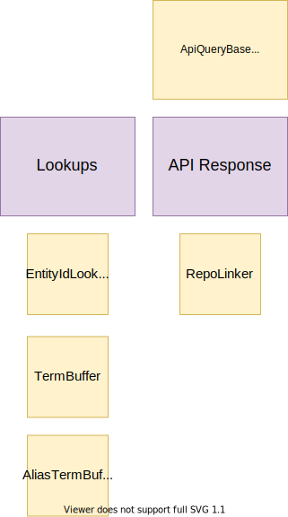
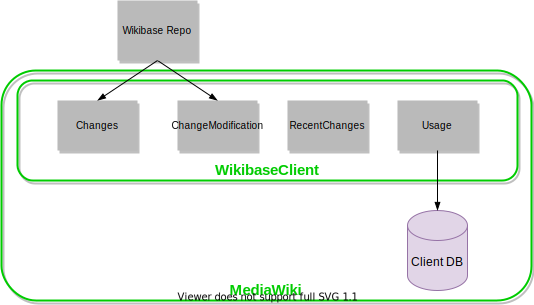
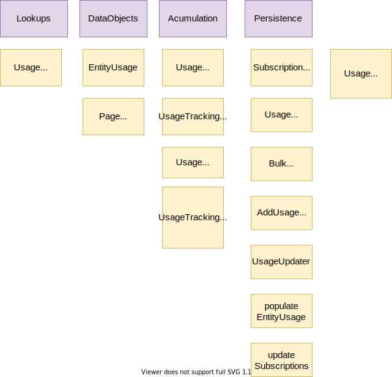

# Building Block View

## Whitebox Overall System

| Building Block                                              | Responsibility                                                              |
| ----------------------------------------------------------- | --------------------------------------------------------------------------- |
| [User Interfaces](#user-interfaces)                         | Represent domain data through MediaWiki user interfaces                     |
| [APIs](#apis)                                               | Represent domain data through MediaWiki APIs                                |
| [Client Side Item Edits](#client-side-item-edits)           | Edit Item Data on the Repository                                            |
| [Linked Site Page Changes](#linked-site-page-changes)       | Inform a Repository of changes to pages that are linked to Repository Items |
| [Entity Data Access](#entity-data-access)                   | Access Entities from a Repository                                           |
| [Entity Change Notifications](#entity-change-notifications) | Be notified about and act on changes to Entities on a Repository            |

## User Interfaces

## APIs

### [Action API Description](https://www.wikidata.org/w/api.php?action=help&modules=query%2Bdescription)

| Building Block    | Type/Context | Responsibility                                       |
| ----------------- | ------------ | ---------------------------------------------------- |
| DescriptionLookup | Lookups      | Lookup client descriptions from a variety of sources |
| RepoLinker        | Response     | Creates links to Repo Entity concepts                |

### [Action API EntityUsage](https://www.wikidata.org/w/api.php?action=help&modules=query%2Bwbentityusage)

| Building Block | Type/Context | Responsibility                        |
| -------------- | ------------ | ------------------------------------- |
| RepoLinker     | Response     | Creates links to Repo Entity concepts |

### [Action API Meta Wikibase](https://www.wikidata.org/w/api.php?action=help&modules=query%2Bwikibase)

!Action API Meta Building Block Diagram](./diagrams/05-api-metawikibase.drawio.svg)

| Building Block | Type/Context | Responsibility                                      |
| -------------- | ------------ | --------------------------------------------------- |
| SettingsArray  | Config       | WikibaseClient settings containing meta information |

### [Action API Page Terms](https://www.wikidata.org/w/api.php?action=help&modules=query%2Bpageterms)

| Building Block  | Type/Context | Responsibility                        |
| --------------- | ------------ | ------------------------------------- |
| EntityIdLookup  | Lookups      | Lookup EntityIds from Titles          |
| TermBuffer      | Lookups      | Lookup buffered Terms                 |
| AliasTermBuffer | Lookups      | Lookup buffered Aliases               |
| RepoLinker      | Response     | Creates links to Repo Entity concepts |

### Action API Format Reference

| Building Block           | Type/Context     | Responsibility                           |
| ------------------------ | ---------------- | ---------------------------------------- |
| Deserializer (Reference) | Input            | Get reference objects from user input    |
| ReferenceFormatter       | Format Reference | Format reference as wikitext             |
| Parser                   | Output           | Parse reference wikitext and output HTML |

## Client Side Item Edits

### Data Bridge

Data Bridge is a frontend component enabling Repo edits on the Client via the Repo API. 

| Building Block | Responsibility                                                                                 |
| -------------- | ---------------------------------------------------------------------------------------------- |
| Data Access    | A group of classes and interfaces for interacting with WikibaseRepo data                       |
| Presentation   | UI components for presentation                                                                 |
| Store          | State management of the UI components                                                          |
| MediaWiki      | Logic that has to do with Data Bridge attaching itself in the right places on the wiki article |
| ChangeOp       | Strategies for applying changes (update or replace) to the entity                              |
| Tracking       | Tracking data bridge usage and errors                                                          |

#### ChangeOp

| Building Block            | Responsibility                                                                     |
| ------------------------- | ---------------------------------------------------------------------------------- |
| ReplaceMutationStrategy   | Strategy for replacing a statement                                                 |
| StatementMutationStrategy | Interface for a statement mutation strategy                                        |
| UpdateMutationStrategy    | Strategy for updating a statement                                                  |
| StatementMutationError    | Represents an error that can occur when mutating a statement                       |
| StatementMutationFactory  | Chooses the right mutation strategy based on the edit decision (replace or update) |

#### MediaWiki

| Building Block           | Responsibility                                                                                                                |
| ------------------------ | ----------------------------------------------------------------------------------------------------------------------------- |
| Dispatcher               | Dispatches Data Bridge to the appropriate DOM element in the wiki article                                                     |
| BridgeDomElementSelector | Selects elements in a wiki article's DOM that can be overloaded with Data Bridge                                              |
| SelectedElement          | An interface which describes a DOM element to which Data Bridge is dispatched                                                 |
| subscribeToEvents        | Actions taken on the wiki page when certain data bridge events occur. E.g. reload the page when the data bridge edit is saved |
| prepareContainer         | Creates a container element based on OO.ui.Dialog in which Data Bridge is placed on the wiki page                             |
| EventTracker             | An abstraction layer for MediaWiki's event tracker                                                                            |

## Linked Site Page Changes

| Building Block     | Responsibility                                                          |
| ------------------ | ----------------------------------------------------------------------- |
| UpdateRepo         | Update the repo after certain changes have been performed in the client |
| UpdateRepoOnDelete | Update the repo after page deletes in the client                        |
| UpdateRepoOnMove   | Update the repo after page moves in the client                          |

## Entity Data Access

| Building Block                       | Responsibility                                                                                |
| ------------------------------------ | --------------------------------------------------------------------------------------------- |
| [Shared](#shared-entity-data-access) | Services shared between multiple types of entity data access (lookups, formatters, utilities) |
| [ParserFunctions](#parserfunctions)  | MediaWiki parser function binding for entity data access                                      |
| [Scribunto](#scribunto)              | Scribunto extension binding for entity data access                                            |

### Shared (Entity Data Access)

| Building Block                  | Responsibility                                                         |
| ------------------------------- | ---------------------------------------------------------------------- |
| SnakFormatter                   | Formats snaks in a client context                                      |
| ReferenceFormatter              | Formats references in a client context                                 |
| StatementTransclusionInteractor | Renders the main snaks associated with a given Property on an Entity   |
| EntityTitleLookup               | Resolves a specific sitelink on a specific Item to a Title             |
| PropertyIdResolver              | Resolved a PropertyId from input which could be a label or prefixed ID |
| SnaksFinder                     | Find Snaks for claims in a given Entity, based on PropertyId           |

### ParserFunctions

| Building Block         | Responsibility                                                          |
| ---------------------- | ----------------------------------------------------------------------- |
| Runner                 | Contains the methods called by MediaWiki when parser functions are used |
| StatementGroupRenderer | Renderer for rendering a statement group                                |

### Scribunto

| Building Block                 | Responsibility                                                                      |
| ------------------------------ | ----------------------------------------------------------------------------------- |
| TermLookup                     | Lookup terms of Entities for use in LUA                                             |
| Scribunto_LuaLibraryBase       | Registers and defined methods called by the Scribunto extension                     |
| LanguageDependentLuaBindings   | Actual implementations of various functions that can be accessed through Scribunto. |
| LanguageIndependentLuaBindings | Actual implementations of various functions that can be accessed through Scribunto. |
| LuaEntityBindings              | Actual implementations of various functions that can be accessed through Scribunto. |
| SnakSerializationRenderer      | Renders snaks for LUA                                                               |
| EntityAccessor                 | Miscellaneous functionality for exposing Entities through LUA                       |
| LuaFunctionCallTracker         | Helper for tracking accesses of Lua functions                                       |

## Entity Change Notifications

| Building Block                               | Responsibility                                                            |
| -------------------------------------------- | ------------------------------------------------------------------------- |
| [Changes](#changes)                          | Receive and handle regular Repository Entity Data changes                 |
| [ChangeModifications](#change-modifications) | Receive and handle changes to the history of Repository Entities          |
| [RecentChanges](#recent-changes)             | Represent changes to Repository Entities in a Client RecentChanges system |
| [Usage](#usage)                              | Tracking the usage of Repository Entities on a Client                     |

### Usage

::: warning
UsageAspectTransformer is only used outside of this block and perhaps shouldn't live here
:::

| Building Block                                      | Responsibility                                                                                         |
| --------------------------------------------------- | ------------------------------------------------------------------------------------------------------ |
| UsageLookup                                         | Find EntityUsages for pages                                                                            |
| EntityUsage                                         | Data object representing the usage of an Entity (but not identifying where it is used)                 |
| PageEntityUsages                                    | Data object associating a EntityUsage with a Page ID                                                   |
| UsageAccumulator                                    | Interface allowing accumulation of usage tracking information for a given page                         |
| UsageTrackingSnakFormatter                          | SnakFormatter implementation that will accumulate usage in a UsageAccumulator                          |
| UsageTrackingLanguageFallbackLabelDescriptionLookup | LanguageFallbackLabelDescriptionLookup implementation that will accumulate usage in a UsageAccumulator |
| UsageDeduplicator                                   | De-duplicates entity usage listsfor performance and storage reasons                                    |
| SubscriptionManager                                 | Persists infomation about pages being "subscribed" to updates for an Entity                            |
| UsageTracker                                        | Persists infomation about the EntityUsages of a page                                                   |
| UsageAspectTransformer                              | Transforms usage aspect based on a filter of aspects relevant in some context.                         |

### Recent Changes

| Building Block         | Responsibility                                                                     |
| ---------------------- | ---------------------------------------------------------------------------------- |
| RecentChangesFinder    | Find RecentChange entries based on their meta data                                 |
| ExtenalChange          | Data object representing a revision that has changed an Entity on an external site |
| RevisionData           | Data object representing a revision on an external site                            |
| ChangeLineFormatter    | Formats and ExternalChange as HTML                                                 |
| SiteLinkCommentCreator | Deals with creating comment infomation relating to SiteLink changes                |

### Changes

| Building Block      | Responsibility                                                                              |
| ------------------- | ------------------------------------------------------------------------------------------- |
| AffectedPagesFinder | Finds PageEntityUsages that are affected by a Change                                        |
| ChangeHandler       | Handles EntityChanges                                                                       |
| ChangeRunCoalescer  | A transformer for lists of EntityChanges that combines runs of changes into a single change |
| InjectRCRecordsJob  | Persists RecentChanges entries                                                              |
| PageUpdater         | Triggers various updates needed when pages will change                                      |

### Change Modifications

| Building Block                    | Responsibility                                        |
| --------------------------------- | ----------------------------------------------------- |
| ChangeModificationNotificationJob | Base for handling Entity Revision changes             |
| ChangeDeletionNotificationJob     | Handles Repository Entity Revision Deletions          |
| ChangeVisibilityNotificationJob   | Handles Repository Entity Revision Visibility Changes |
