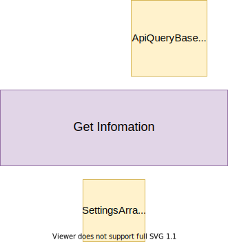
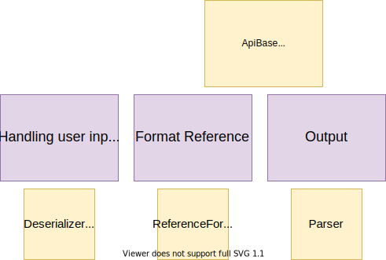
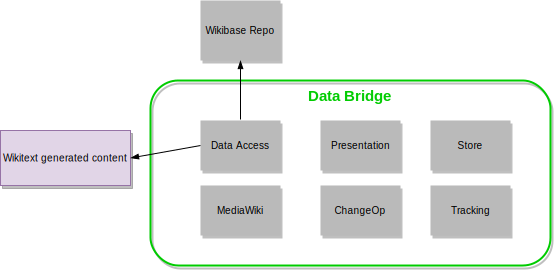
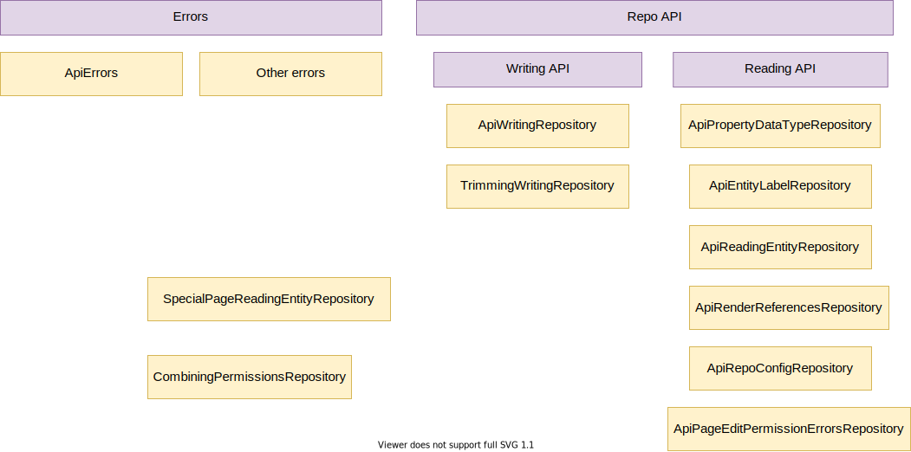
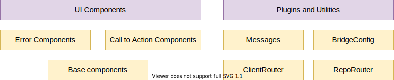
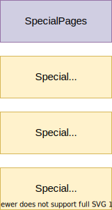
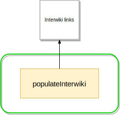

# Building Block View

## Whitebox Overall System

| Building Block                                              | Responsibility                                                                                                                                               |
| ----------------------------------------------------------- | ------------------------------------------------------------------------------------------------------------------------------------------------------------ |
| [APIs](#apis)                                               | Represent domain data through MediaWiki APIs                                                                                                                 |
| [Entity Data Access](#entity-data-access)                   | Access [Entities](../overview/12-Glossary.md#entity) from a Repository                                                                                       |
| [Usage Tracking](#usage)                                    | Tracking the usage of Repository Entities on a Client                                                                                                        |
| [Entity Change Notifications](#entity-change-notifications) | Be notified about and act on changes to Entities on a Repository                                                                                             |
| [Linked Site Page Changes](#linked-site-page-changes)       | Inform a Repository of changes to [pages that are linked](../overview/12-Glossary.md#connected-pages) to Repository [Items](../overview/12-Glossary.md#item) |
| [Client Side Item Edits](#client-side-item-edits)           | Edit Item [data values](../overview/12-Glossary.md#datavalue) on the Repository                                                                              |
| [Special Pages](#special-pages)                             | WikibaseClient specific [Special Pages](../overview/12-Glossary.md#special-page)                                                                             |
| [Interwiki](#interwiki)                                     | Client side interactions with [Interwiki links](../overview/12-Glossary.md#interwiki-links)                                                                  |

## APIs

### [Action API Description](https://www.wikidata.org/w/api.php?action=help&modules=query%2Bdescription)

| Building Block    | Type/Context | Responsibility                                                                                 |
| ----------------- | ------------ | ---------------------------------------------------------------------------------------------- |
| DescriptionLookup | Lookups      | Lookup client [descriptions](../overview/12-Glossary.md#description) from a variety of sources |
| RepoLinker        | Response     | Creates links to Repo Entity concepts                                                          |

### [Action API EntityUsage](https://www.wikidata.org/w/api.php?action=help&modules=query%2Bwbentityusage)

| Building Block | Type/Context | Responsibility                        |
| -------------- | ------------ | ------------------------------------- |
| RepoLinker     | Response     | Creates links to Repo Entity concepts |

### [Action API Meta Wikibase](https://www.wikidata.org/w/api.php?action=help&modules=query%2Bwikibase)

| Building Block | Type/Context | Responsibility                                      |
| -------------- | ------------ | --------------------------------------------------- |
| SettingsArray  | Config       | WikibaseClient settings containing meta information |

### [Action API Page Terms](https://www.wikidata.org/w/api.php?action=help&modules=query%2Bpageterms)

| Building Block  | Type/Context | Responsibility                                                   |
| --------------- | ------------ | ---------------------------------------------------------------- |
| EntityIdLookup  | Lookups      | Lookup EntityIds from [Titles](../overview/12-Glossary.md#title) |
| TermBuffer      | Lookups      | Lookup buffered [Terms](../overview/12-Glossary.md#term)         |
| AliasTermBuffer | Lookups      | Lookup buffered [Aliases](../overview/12-Glossary.md#alias)      |
| RepoLinker      | Response     | Creates links to Repo Entity concepts                            |

### Action API Format Reference

| Building Block           | Type/Context     | Responsibility                                                                |
| ------------------------ | ---------------- | ----------------------------------------------------------------------------- |
| Deserializer (Reference) | Input            | Get [Reference](../overview/12-Glossary.md#reference) objects from user input |
| ReferenceFormatter       | Format Reference | Format Reference as wikitext                                                  |
| Parser                   | Output           | Parse Reference wikitext and output HTML                                      |

## Entity Data Access

| Building Block                       | Responsibility                                                                                |
| ------------------------------------ | --------------------------------------------------------------------------------------------- |
| [Shared](#shared-entity-data-access) | Services shared between multiple types of entity data access (lookups, formatters, utilities) |
| [ParserFunctions](#parserfunctions)  | MediaWiki parser function binding for entity data access                                      |
| [Scribunto](#scribunto)              | Scribunto extension binding for entity data access                                            |

::: tip
You can see the interactions of components related to Entity Data Access in [the runtime view diagrams](./06-Runtime_View.md#entity-data-access).
:::

### Shared (Entity Data Access)

| Building Block                  | Responsibility                                                                                             |
| ------------------------------- | ---------------------------------------------------------------------------------------------------------- |
| SnakFormatter                   | Formats [Snaks](../overview/12-Glossary.md#snak) in a client context                                       |
| ReferenceFormatter              | Formats references in a client context                                                                     |
| StatementTransclusionInteractor | Renders the main snaks associated with a given Property on an Entity                                       |
| EntityTitleLookup               | Resolves a specific sitelink on a specific Item to a [Title](../overview/12-Glossary.md#title)             |
| PropertyIdResolver              | Resolves a PropertyId from input which could be a [Label](../overview/12-Glossary.md#label) or prefixed ID |
| SnaksFinder                     | Find Snaks for claims in a given Entity, based on PropertyId                                               |

### ParserFunctions

| Building Block         | Responsibility                                                                   |
| ---------------------- | -------------------------------------------------------------------------------- |
| Runner                 | Contains the methods called by MediaWiki when parser functions are used          |
| StatementGroupRenderer | Renderer for rendering a [statement](../overview/12-Glossary.md#statement) group |

### Scribunto

| Building Block                 | Responsibility                                                                      |
| ------------------------------ | ----------------------------------------------------------------------------------- |
| TermLookup                     | Lookup terms of Entities for use in LUA                                             |
| Scribunto_LuaLibraryBase       | Registers and defined methods called by the Scribunto extension                     |
| LanguageDependentLuaBindings   | Actual implementations of various functions that can be accessed through Scribunto. |
| LanguageIndependentLuaBindings | Actual implementations of various functions that can be accessed through Scribunto. |
| LuaEntityBindings              | Actual implementations of various functions that can be accessed through Scribunto. |
| SnakSerializationRenderer      | Renders snaks for LUA                                                               |
| EntityAccessor                 | Miscellaneous functionality for exposing Entities through LUA                       |
| LuaFunctionCallTracker         | Helper for tracking accesses of Lua functions                                       |

## Entity Change Notifications

| Building Block                               | Responsibility                                                            |
| -------------------------------------------- | ------------------------------------------------------------------------- |
| [Changes](#changes)                          | Receive and handle regular Repository Entity Data changes                 |
| [ChangeModifications](#change-modifications) | Receive and handle changes to the history of Repository Entities          |
| [RecentChanges](#recent-changes)             | Represent changes to Repository Entities in a Client RecentChanges system |
| [Usage](#usage)                              | Tracking the usage of Repository Entities on a Client                     |

::: tip
You can see the interactions of components related to Entity Change Notifications in [the runtime view diagrams](./06-Runtime_View.md#entity-change-notifications).
:::

### Changes

| Building Block      | Responsibility                                                                              |
| ------------------- | ------------------------------------------------------------------------------------------- |
| AffectedPagesFinder | Finds PageEntityUsages that are affected by a Change                                        |
| ChangeHandler       | Handles EntityChanges                                                                       |
| ChangeRunCoalescer  | A transformer for lists of EntityChanges that combines runs of changes into a single change |
| InjectRCRecordsJob  | Persists RecentChanges entries                                                              |
| PageUpdater         | Triggers various updates needed when pages will change                                      |

### Change Modifications

| Building Block                    | Responsibility                                        |
| --------------------------------- | ----------------------------------------------------- |
| ChangeModificationNotificationJob | Base for handling Entity Revision changes             |
| ChangeDeletionNotificationJob     | Handles Repository Entity Revision Deletions          |
| ChangeVisibilityNotificationJob   | Handles Repository Entity Revision Visibility Changes |

### Recent Changes

| Building Block         | Responsibility                                                                     |
| ---------------------- | ---------------------------------------------------------------------------------- |
| RecentChangesFinder    | Find RecentChange entries based on their meta data                                 |
| ExtenalChange          | Data object representing a revision that has changed an Entity on an external site |
| RevisionData           | Data object representing a revision on an external site                            |
| ChangeLineFormatter    | Formats and ExternalChange as HTML                                                 |
| SiteLinkCommentCreator | Deals with creating comment infomation relating to SiteLink changes                |

## Usage

<!---
This has become quite a big building block. It can likely be split up further, possibly splitting out "subscription" related components and/or dividing it into read and write components?
-->

::: warning
UsageAspectTransformer is only used outside of this block and perhaps shouldn't live here
:::

| Building Block                                      | Responsibility                                                                                                               |
| --------------------------------------------------- | ---------------------------------------------------------------------------------------------------------------------------- |
| UsageLookup                                         | Find EntityUsages for pages                                                                                                  |
| EntityUsage                                         | Data object representing the usage of an Entity (but not identifying where it is used)                                       |
| PageEntityUsages                                    | Data object associating a EntityUsage with a Page ID                                                                         |
| UsageAccumulator                                    | Interface allowing accumulation of usage tracking information for a given page                                               |
| UsageTrackingSnakFormatter                          | SnakFormatter implementation that will accumulate usage in a UsageAccumulator                                                |
| UsageTrackingLanguageFallbackLabelDescriptionLookup | LanguageFallbackLabelDescriptionLookup implementation that will accumulate usage in a UsageAccumulator                       |
| UsageDeduplicator                                   | De-duplicates entity usage listsfor performance and storage reasons                                                          |
| SubscriptionManager                                 | Persists infomation about pages being "subscribed" to updates for an Entity                                                  |
| UsageTracker                                        | Persists infomation about the EntityUsages of a page                                                                         |
| UsageAspectTransformer                              | Transforms usage aspect based on a filter of aspects relevant in some context.                                               |
| BulkSubscriptionUpdater                             | Bulk inserts for subscriptions into wb_changes_subscription based on wbc_entity_usage.                                       |
| AddUsagesForPageJob                                 | Job for scheduled invocation of UsageUpdater which is triggered by a MediaWiki hook related to Wikitext-based content edits. |
| UsageUpdater                                        | Service for updating usage tracking and associated change subscription information.                                          |
| populateEntityUsage                                 | Maintenance script for populating wbc_entity_usage based on the page_props table.                                            |
| updateSubscriptions                                 | Maintenance script for inserting subscriptions into wb_changes_subscription based on wbc_entity_usage.                       |

## [Linked Site Page](../overview/12-Glossary.md#connected-pages) Changes

| Building Block     | Responsibility                                                          |
| ------------------ | ----------------------------------------------------------------------- |
| UpdateRepo         | Update the repo after certain changes have been performed in the client |
| UpdateRepoOnDelete | Update the repo after page deletes in the client                        |
| UpdateRepoOnMove   | Update the repo after page moves in the client                          |

::: tip
You can see the interactions of components related to Linked Site Page Changes in [the runtime view diagrams](./06-Runtime_View.md#updaterepohookhandler).
:::

## Client Side Item Edits

### Data Bridge

Data Bridge is a frontend component enabling Repo edits on the Client via the Repo API.

| Building Block | Responsibility                                                                                       |
| -------------- | ---------------------------------------------------------------------------------------------------- |
| Data Access    | A group of classes and interfaces for interacting with WikibaseRepo data and MediaWiki functionality |
| Presentation   | UI components for presentation                                                                       |
| Store          | State management of the UI components                                                                |
| MediaWiki      | Logic that has to do with Data Bridge attaching itself in the right places on the wiki article       |
| ChangeOp       | Strategies for applying changes (update or replace) to the entity                                    |
| Tracking       | Tracking data bridge usage and errors                                                                |

::: tip
You can see the interactions of components related to Data Bridge in [the runtime view diagrams](./06-Runtime_View.md#data-bridge).
:::

#### ChangeOp

| Building Block            | Responsibility                                                                     |
| ------------------------- | ---------------------------------------------------------------------------------- |
| ReplaceMutationStrategy   | Strategy for replacing a [statement](../overview/12-Glossary.md#statement)         |
| StatementMutationStrategy | Interface for a statement mutation strategy                                        |
| UpdateMutationStrategy    | Strategy for updating a statement                                                  |
| StatementMutationError    | Represents an error that can occur when mutating a statement                       |
| StatementMutationFactory  | Chooses the right mutation strategy based on the edit decision (replace or update) |

#### MediaWiki

| Building Block           | Responsibility                                                                                                                |
| ------------------------ | ----------------------------------------------------------------------------------------------------------------------------- |
| Dispatcher               | Dispatches Data Bridge to the appropriate DOM element in the wiki article                                                     |
| BridgeDomElementSelector | Selects elements in a wiki article's DOM that can be overloaded with Data Bridge                                              |
| SelectedElement          | An interface which describes a DOM element to which Data Bridge is dispatched                                                 |
| subscribeToEvents        | Actions taken on the wiki page when certain data bridge events occur. E.g. reload the page when the data bridge edit is saved |
| prepareContainer         | Creates a container element based on OO.ui.Dialog in which Data Bridge is placed on the wiki page                             |
| EventTracker             | An abstraction layer for MediaWiki's event tracker                                                                            |

#### Data Access

| Building Block                        | Responsibility                                                                                                                         |
| ------------------------------------- | -------------------------------------------------------------------------------------------------------------------------------------- |
| Errors                                | Provide context about errors that might occur in Data Bridge. The native Error TypeScript class is used                                |
| ApiErrors                             | Error returned from the Repo API                                                                                                       |
| Other Errors                          | Error that may occur in Data Bridge and are not related to the API, e.g. an error on saving                                            |
| Repo API                              | Implementations of WikibaseRepo API requests                                                                                           |
| Reading API                           | Implementations of WikibaseRepo API requests that have to do with reading from repo                                                    |
| Writing API                           | Implementations of WikibaseRepo API requests that have to do with writing to repo                                                      |
| ApiEntityLabelRepository              | A repository to get the [label](../overview/12-Glossary.md#label) of specific entity in a specific language                            |
| ApiPageEditPermissionErrorsRepository | A repository for determining potential permission errors when editing a page.                                                          |
| ApiPropertyDataTypeRepository         | A repository to get the [datatype](../overview/12-Glossary.md#datatype) of a property                                                  |
| ApiRenderReferencesRepository         | A repository to render reference JSON blobs into HTML strings                                                                          |
| ApiReadingEntityRepository            | A repository for reading the latest revision of an entity.                                                                             |
| ApiRepoConfigRepository               | A repository to get the configuration from the Wikibase repo instance where the data is going to be saved                              |
| ApiWritingRepository                  | Saves the modified entity                                                                                                              |
| CombiningPermissionsRepository        | A repository for determining potential permission errors when using the Data Bridge                                                    |
| TrimmingWritingRepository             | A WritingEntityRepository that compares the old and new entity data and sends parts that changed to an underlying ApiWritingRepository |
| SpecialPageReadingEntityRepository    | A repository for reading the latest revision of an entity                                                                              |

#### Presentation

| Building Block            | Responsibility                                                                                                                |
| ------------------------- | ----------------------------------------------------------------------------------------------------------------------------- |
| UI Components             | All presentational components that construct Data Bridge's modal and its contents                                             |
| Plugins and Utilities     | Logic which is common for several components, e.g. representing messages from mw's i18n mechanism                             |
| Error Components          | Front end components that represent an error which occurred in Data Bridge                                                    |
| Call To Action Components | Front end components that require an action from the user                                                                     |
| Base components           | Purely presentational components, e.g. a button. Those components will be replaced by Design System components in the future. |
| Messages                  | A wrapper around MediaWiki's i18n mechanism                                                                                   |
| ClientRouter              | Format page urls for client                                                                                                   |
| RepoRouter                | Format page urls for repo                                                                                                     |
| BridgeConfig              | Configuration needed in some UI components, e.g. the link for reporting issues with data bridge                               |

## Special Pages

| Building Block                                           | Type/Context   | Responsibility                                                               |
| -------------------------------------------------------- | -------------- | ---------------------------------------------------------------------------- |
| [Special Pages](../overview/12-Glossary.md#special-page) | WikibaseClient | Provide entity usage meta information                                        |
| SpecialEntityUsage                                       | WikibaseClient | Lists client wiki pages that use a given entity ID and the aspects they use  |
| SpecialPagesWithBadges                                   | WikibaseClient | Shows a list of pages with a given [badge](../overview/12-Glossary.md#badge) |
| SpecialUnconnectedPages                                  | WikibaseClient | Lists client pages that are not connected to repository items                |

## Interwiki

| Building Block    | Responsibility                                                                                        |
| ----------------- | ----------------------------------------------------------------------------------------------------- |
| populateInterwiki | Maintenance script that populates the interwiki table in the client's MediaWiki DB with list of sites |
