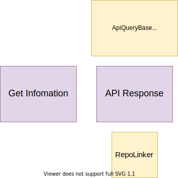

# Building Block View

## Whitebox Overall System

| Building Block                                              | Responsibility                                                              |
| ----------------------------------------------------------- | --------------------------------------------------------------------------- |
| [User Interfaces](#user-interfaces)                         | Represent domain data through MediaWiki user interfaces                     |
| [APIs](#apis)                                               | Represent domain data through MediaWiki APIs                                |
| [Client Side Item Edits](#client-side-item-edits)           | Edit Item Data on the Repository                                            |
| [Linked Site Page Changes](#linked-site-page-changes)       | Inform a Repository of changes to pages that are linked to Repository Items |
| [Entity Data Access](#entity-data-access)                   | Access Entities from a Repository                                           |
| [Entity Change Notifications](#entity-change-notifications) | Be notified about and act on changes to Entities on a Repository            |

## User Interfaces

## APIs

### [Action API Description](https://www.wikidata.org/w/api.php?action=help&modules=query%2Bdescription)

| Building Block    | Type/Context | Responsibility                                       |
| ----------------- | ------------ | ---------------------------------------------------- |
| DescriptionLookup | Lookups      | Lookup client descriptions from a variety of sources |
| RepoLinker        | Response     | Creates links to Repo Entity concepts                |

### [Action API EntityUsage](https://www.wikidata.org/w/api.php?action=help&modules=query%2Bwbentityusage)

| Building Block | Type/Context | Responsibility                        |
| -------------- | ------------ | ------------------------------------- |
| RepoLinker     | Response     | Creates links to Repo Entity concepts |

### [Action API Meta Wikibase](https://www.wikidata.org/w/api.php?action=help&modules=query%2Bwikibase)

!Action API Meta Building Block Diagram](./diagrams/05-api-metawikibase.drawio.svg)

| Building Block | Type/Context | Responsibility                                      |
| -------------- | ------------ | --------------------------------------------------- |
| SettingsArray  | Config       | WikibaseClient settings containing meta information |

### [Action API Page Terms](https://www.wikidata.org/w/api.php?action=help&modules=query%2Bpageterms)

| Building Block  | Type/Context | Responsibility                        |
| --------------- | ------------ | ------------------------------------- |
| EntityIdLookup  | Lookups      | Lookup EntityIds from Titles          |
| TermBuffer      | Lookups      | Lookup buffered Terms                 |
| AliasTermBuffer | Lookups      | Lookup buffered Aliases               |
| RepoLinker      | Response     | Creates links to Repo Entity concepts |

### Action API Format Reference

| Building Block           | Type/Context     | Responsibility                           |
| ------------------------ | ---------------- | ---------------------------------------- |
| Deserializer (Reference) | Input            | Get reference objects from user input    |
| ReferenceFormatter       | Format Reference | Format reference as wikitext             |
| Parser                   | Output           | Parse reference wikitext and output HTML |

## Client Side Item Edits

| Building Block                                      | Responsibility                                                                                                                                                                         |
| --------------------------------------------------- | -------------------------------------------------------------------------------------------------------------------------------------------------------------------------------------- |
| Usage                                               | A group of interfaces and classes that track the usage of Repo entities on a Client. [More info here](https://doc.wikimedia.org/Wikibase/master/php/md_docs_topics_usagetracking.html) |
| Recent Changes                                      | Display of Repo changes on a Client ([Recent Changes page](https://www.mediawiki.org/wiki/Help:Recent_changes))                                                                        |
| Changes                                             | Handling for EntityChanges from a Repo                                                                                                                                                 |
| ChangeModification                                  | Handling of modifications to a set of client changes                                                                                                                                   |
| SubscriptionManager                                 | Tracking subscriptions of clients to entity change events generated on the repo                                                                                                        |
| UsageTrackingLanguageFallbackLabelDescriptionLookup | LanguageFallbackLabelDescriptionLookup decorator that records label usage in an UsageAccumulator                                                                                       |
| ParserOutputUsageAccumulator                        | Encapsulates the knowledge about how usage is tracked in the ParserOutput                                                                                                              |
| UsageTrackingSnakFormatter                          | SnakFormatter decorator that records entity usage                                                                                                                                      |
| UsageAspectTransformer                              | Transforms usage aspect based on a filter of aspects relevant in some context                                                                                                          |
| UsageLookup                                         | Looks up the usage of entities across pages on the local wiki                                                                                                                          |
| NullSubscriptionManager                             | No-op implementation of the SubscriptionManager and UsageLookup interfaces                                                                                                             |
| NullUsageTracker                                    | No-op implementation of the UsageTracker and UsageLookup interfaces                                                                                                                    |
| EntityUsageTable                                    | Helper class for updating the wbc_entity_usage table                                                                                                                                   |
| SqlUsageTracker                                     | An SQL based usage tracker implementation                                                                                                                                              |
| EntityUsageTableBuilder                             | Implements initial population (priming) for the wbc_entity_usage table, based on "wikibase_item" entries in the page_props table                                                       |
| SqlSubscriptionManager                              | SubscriptionManager implementation backed by an SQL table                                                                                                                              |
| SqlUsageTrackerSchemaUpdater                        | Schema updater for SqlUsageTracker                                                                                                                                                     |
| UsageTrackerException                               | Usage tracker exception                                                                                                                                                                |
| EntityUsageFactory                                  | Factory service for generating EntityUsage objects based on their identity strings                                                                                                     |
| HashUsageAccumulator                                | An implementation of the UsageAccumulator interface that wraps an array containing the usage information                                                                               |
| ImplicitDescriptionUsageLookup                      | A UsageLookup which decorates an inner lookup and adds an implicit usage on a linked item’s description                                                                                |
| UsageDeduplicator                                   | De-duplicates entity usages for performance and storage reasons                                                                                                                        |
| EntityUsage                                         | Value object representing the usage of an entity. It includes information about how the entity is used, but not where it's used                                                        |
| UsageAccumulator                                    | Interface and base class for objects accumulating usage tracking information for a given page                                                                                          |
| UsageTracker                                        | Service interface for tracking the usage of entities across pages on the local wiki                                                                                                    |
| PageEntityUsages                                    | Value object representing the entity usages on a single page                                                                                                                           |
| ExternalChangeFactory                               | Factory service for generating ExternalChange objects from recent changes                                                                                                              |
| RecentChangesFinder                                 | Finds a recent change if it exists in recent_changes table                                                                                                                             |
| RecentChangeFactory                                 | Creates a local RecentChange object that corresponds to the EntityChange from the repo, with respect to the given target page                                                          |
| SiteLinkCommentCreator                              | Creates an array structure with comment information for storing in the rc_params column of the RecentChange table, for use in generating recent change comments for wikibase changes   |
| RevisionData                                        | Represents a revision on a site                                                                                                                                                        |
| ExternalChange                                      | Represents an external change                                                                                                                                                          |
| ChangeLineFormatter                                 | Formats a changes line for including changes from the Wikibase repo in the client's recent changes, watchlist and related changes special pages                                        |
| WikiPageUpdater                                     | Service object for triggering different kinds of page updates and generally notifying the local wiki of external changes                                                               |
| ChangeRunCoalescer                                  | A transformer for lists of EntityChanges that combines runs of changes into a single change                                                                                            |
| ChangeHandler                                       | Interface for change handling                                                                                                                                                          |
| InjectRCRecordsJob                                  | A job for injecting RecentChange records representing changes on the Wikibase repository                                                                                               |
| AffectedPagesFinder                                 | Finds pages affected by a change                                                                                                                                                       |
| PageUpdater                                         | Service object for triggering different kinds of page updates and generally notifying the local wiki of external changes                                                               |
| ChangeDeletionNotificationJob                       | A job for notifying a client wiki of a batch of revision deletions on the repository                                                                                                   |
| ChangeModificationNotificationJob                   | Base class for Jobs handling modifications to a set of client changes                                                                                                                  |
| ChangeVisibilityNotificationJob                     | A job for notifying a client wiki of a batch of revision visibility changes on the repository                                                                                          |

## Linked Site Page Changes

## Entity Data Access

## Entity Change Notifications

| Building Block                               | Responsibility                                                            |
| -------------------------------------------- | ------------------------------------------------------------------------- |
| [Changes](#changes)                          | Receive and handle regular Repository Entity Data changes                 |
| [ChangeModifications](#change-modifications) | Receive and handle changes to the history of Repository Entities          |
| [RecentChanges](#recent-changes)             | Represent changes to Repository Entities in a Client RecentChanges system |
| [Usage](#usage)                              | Tracking the usage of Repository Entities on a Client                     |

### Usage

::: warning
UsageAspectTransformer is only used outside of this block and perhaps shouldn't live here
:::

| Building Block                                      | Responsibility                                                                                         |
| --------------------------------------------------- | ------------------------------------------------------------------------------------------------------ |
| UsageLookup                                         | Find EntityUsages for pages                                                                            |
| EntityUsage                                         | Data object representing the usage of an Entity (but not identifying where it is used)                 |
| PageEntityUsages                                    | Data object associating a EntityUsage with a Page ID                                                   |
| UsageAccumulator                                    | Interface allowing accumulation of usage tracking information for a given page                         |
| UsageTrackingSnakFormatter                          | SnakFormatter implementation that will accumulate usage in a UsageAccumulator                          |
| UsageTrackingLanguageFallbackLabelDescriptionLookup | LanguageFallbackLabelDescriptionLookup implementation that will accumulate usage in a UsageAccumulator |
| UsageDeduplicator                                   | De-duplicates entity usage listsfor performance and storage reasons                                    |
| SubscriptionManager                                 | Persists infomation about pages being "subscribed" to updates for an Entity                            |
| UsageTracker                                        | Persists infomation about the EntityUsages of a page                                                   |
| UsageAspectTransformer                              | Transforms usage aspect based on a filter of aspects relevant in some context.                         |

### Recent Changes

| Building Block         | Responsibility                                                                     |
| ---------------------- | ---------------------------------------------------------------------------------- |
| RecentChangesFinder    | Find RecentChange entries based on their meta data                                 |
| ExtenalChange          | Data object representing a revision that has changed an Entity on an external site |
| RevisionData           | Data object representing a revision on an external site                            |
| ChangeLineFormatter    | Formats and ExternalChange as HTML                                                 |
| SiteLinkCommentCreator | Deals with creating comment infomation relating to SiteLink changes                |

### Changes

| Building Block      | Responsibility                                                                              |
| ------------------- | ------------------------------------------------------------------------------------------- |
| AffectedPagesFinder | Finds PageEntityUsages that are affected by a Change                                        |
| ChangeHandler       | Handles EntityChanges                                                                       |
| ChangeRunCoalescer  | A transformer for lists of EntityChanges that combines runs of changes into a single change |
| InjectRCRecordsJob  | Persists RecentChanges entries                                                              |
| PageUpdater         | Triggers various updates needed when pages will change                                      |

### Change Modifications

| Building Block                    | Responsibility                                        |
| --------------------------------- | ----------------------------------------------------- |
| ChangeModificationNotificationJob | Base for handling Entity Revision changes             |
| ChangeDeletionNotificationJob     | Handles Repository Entity Revision Deletions          |
| ChangeVisibilityNotificationJob   | Handles Repository Entity Revision Visibility Changes |
