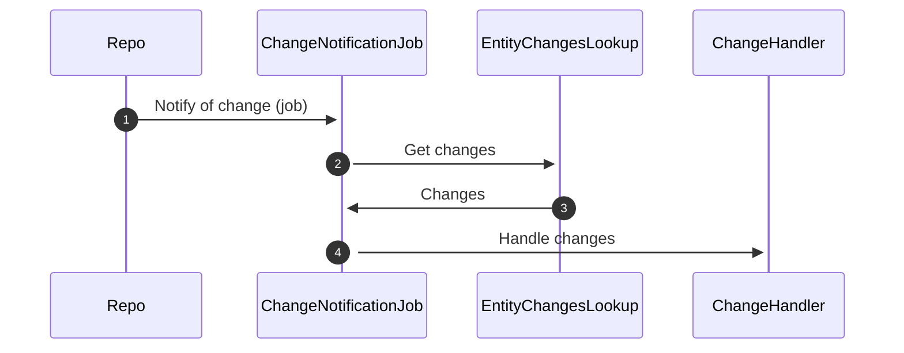
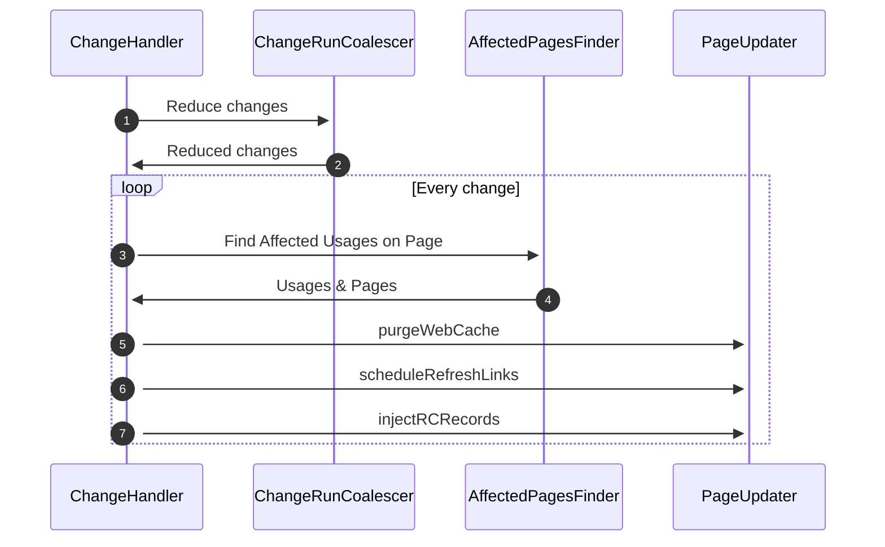

# Runtime View

## Runtime Scenario 1

## Runtime Scenario 2

## Entity Change Notifications

### Entity change events entering the Client

A Repo will schedule Jobs on Clients including change data that the Client needs.

### Handle change events on the Client

...
