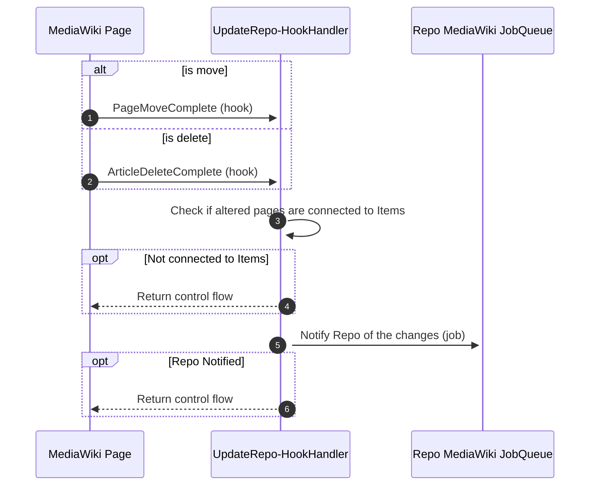
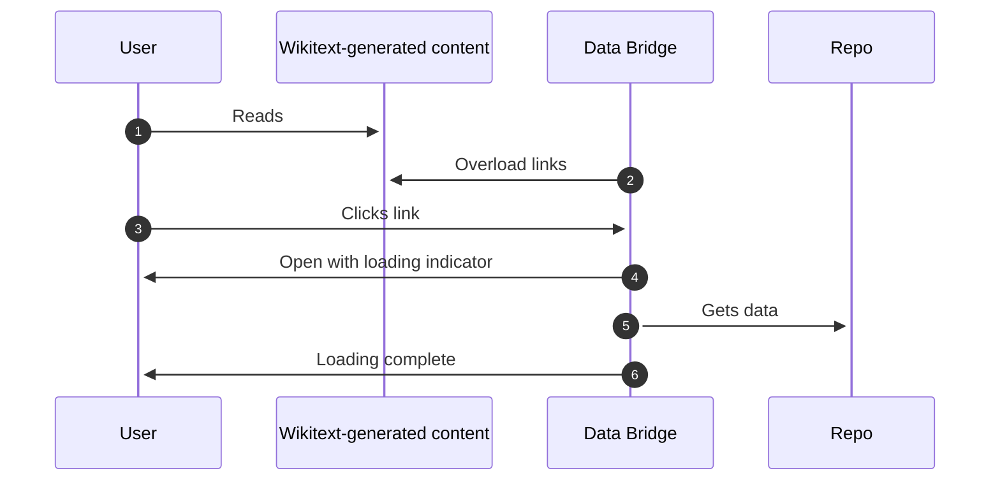
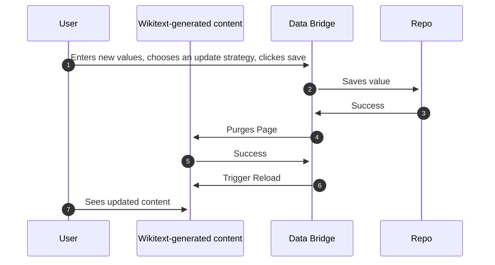
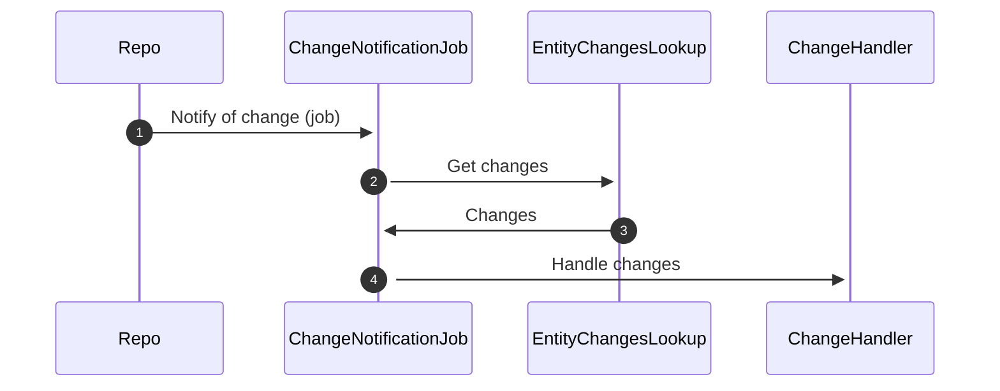
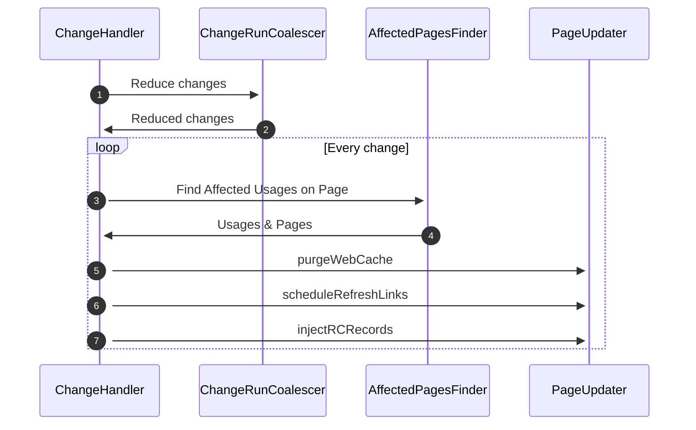

# Runtime View

## UpdateRepoHookHandler

## Data Bridge

### Attachment and Opening

The Data Bridge is injected into Wikitext-generated content pages that have edit links by overloading the links.

Clicking on one of these links then opens the Data Bridge instead of taking you to the Repo.

### Supported value change

Once the Data Bridge is open the User can edit supported values.

## Entity Change Notifications

### Entity change events entering the Client

A Repo will schedule Jobs on Clients including change data that the Client needs.

### Handle change events on the Client

...
