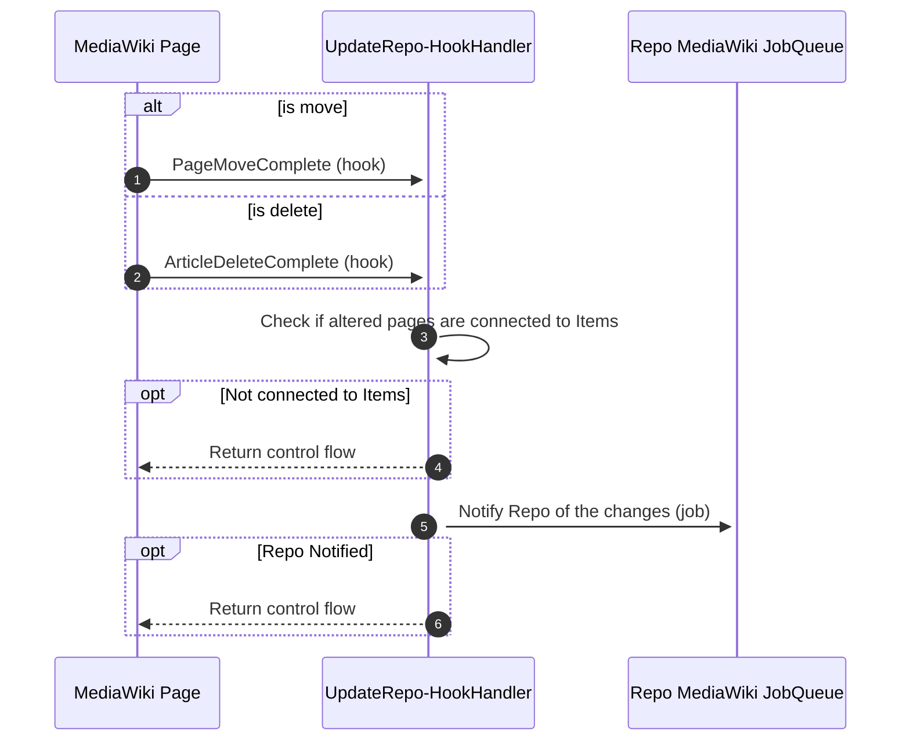

# Runtime View

## UpdateRepoHookHandler

```mermaid
sequenceDiagram
    autonumber
    alt is move
        MediaWiki Page->>+UpdateRepo-HookHandler: PageMoveComplete (hook)
    else is delete
        MediaWiki Page->>+UpdateRepo-HookHandler: ArticleDeleteComplete (hook)
    end
    UpdateRepo-HookHandler->>UpdateRepo-HookHandler: Check if altered pages are connected to Items
    opt Not connected to Items
        UpdateRepo-HookHandler-->>MediaWiki Page: Return control flow
    end
    UpdateRepo-HookHandler->>+Repo MediaWiki JobQueue: Notify Repo of the changes (job)
    opt Repo Notified
        UpdateRepo-HookHandler-->>MediaWiki Page: Return control flow
    end
```

## Runtime Scenario 2

## Runtime Scenario 3

...
