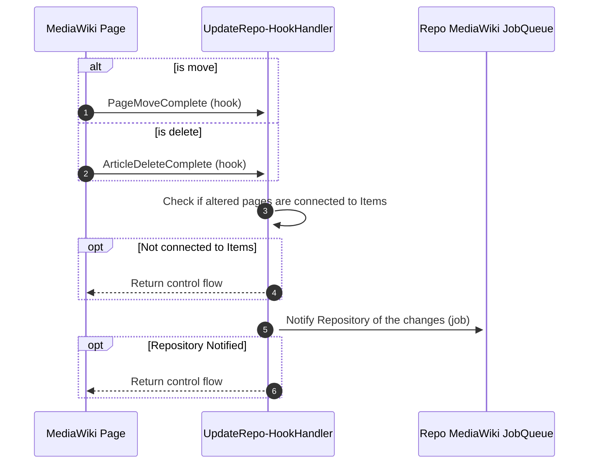
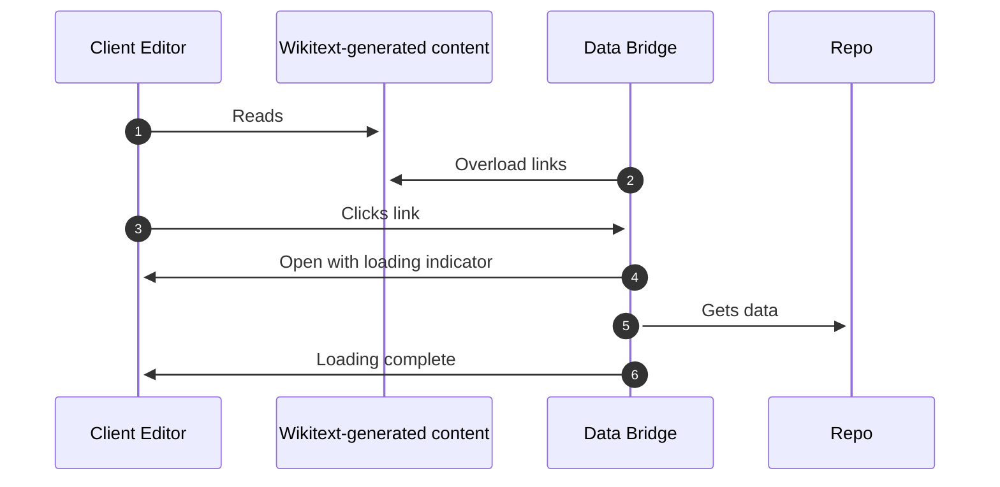
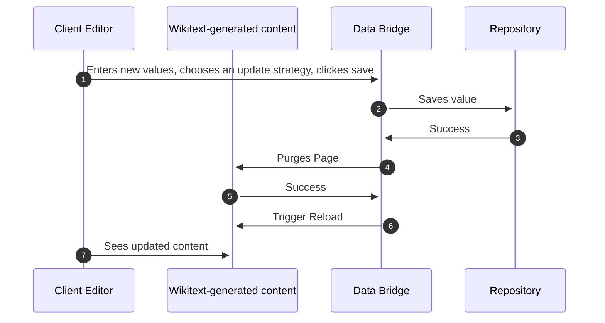
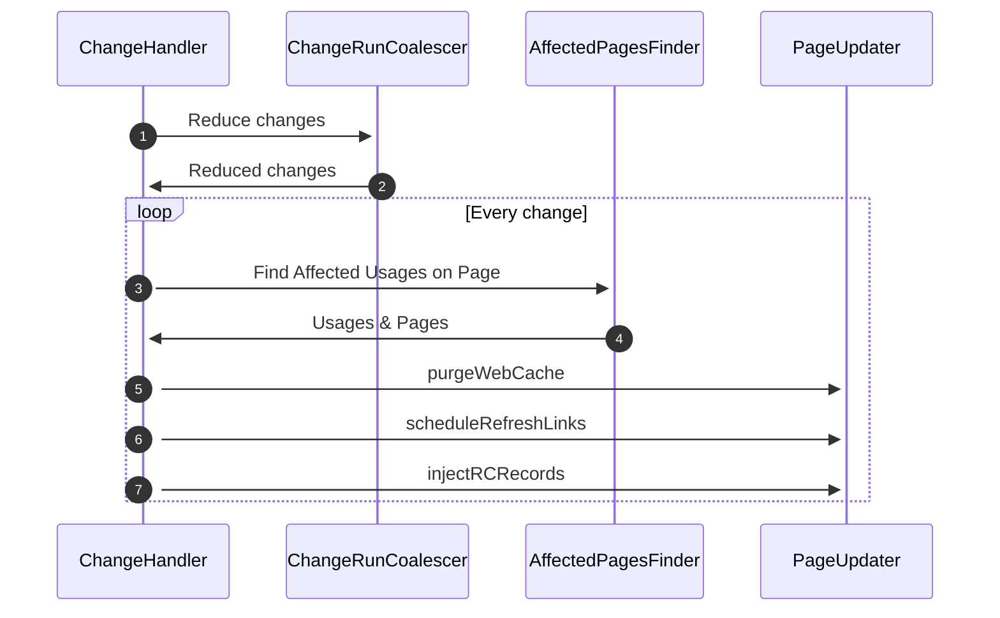
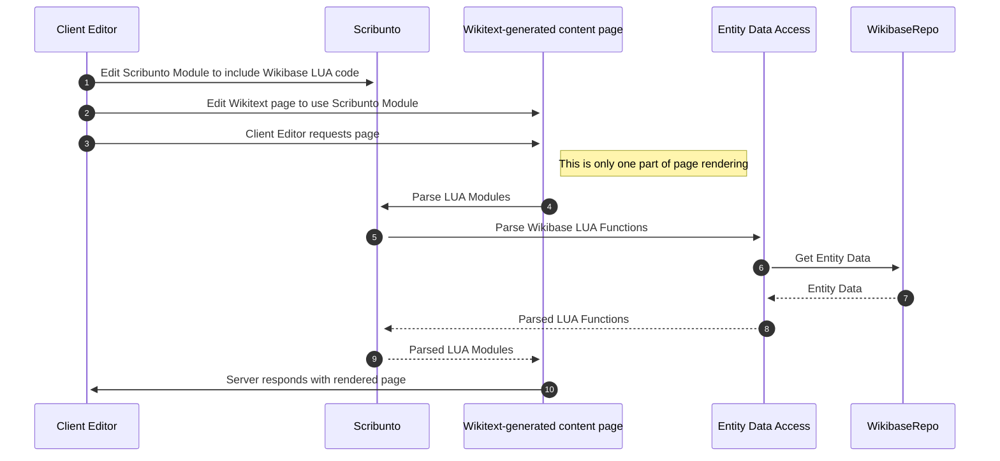
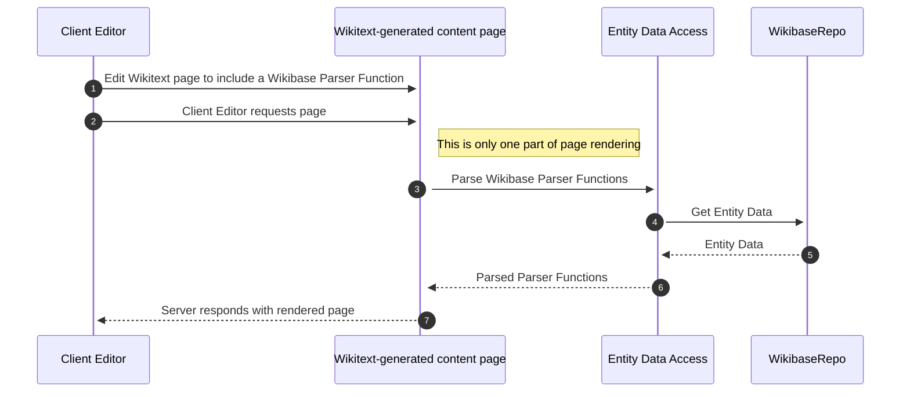

# Runtime View

## UpdateRepoHookHandler

see the [Wikipedia editor's use case](01-Introduction_and_Goals.md#wikipedia-editor): _Have interwiki links keep up to date, when pages are moved or deleted_

## Data Bridge

see the [Wikipedia editor's use case](01-Introduction_and_Goals.md#wikipedia-editor): _Update Wikidata’s data used on Wikipedia_

### Attachment and Opening

The Data Bridge is injected into Wikitext-generated content pages that have edit links by overloading the links.

Clicking on one of these links then opens the Data Bridge instead of taking you to the Repository.

### Supported value change

Once the Data Bridge is open the Client Editor can edit supported values.

## Entity Change Notifications

see the [Wikibase Client editor's use case](01-Introduction_and_Goals.md#wikibase-client-editor) _Have Repository data used in Client pages update automatically, when changes happen_

### Entity change events entering the Client

A Repository will schedule Jobs on Clients including change data that the Client needs.

### Handle change events on the Client

## Entity Data Access

see the [Wikibase Client editor's use case](01-Introduction_and_Goals.md#wikibase-client-editor) _Use Repository data in Client wikitext generated content_

### Using data via LUA

### Using data via ParserFunctions

