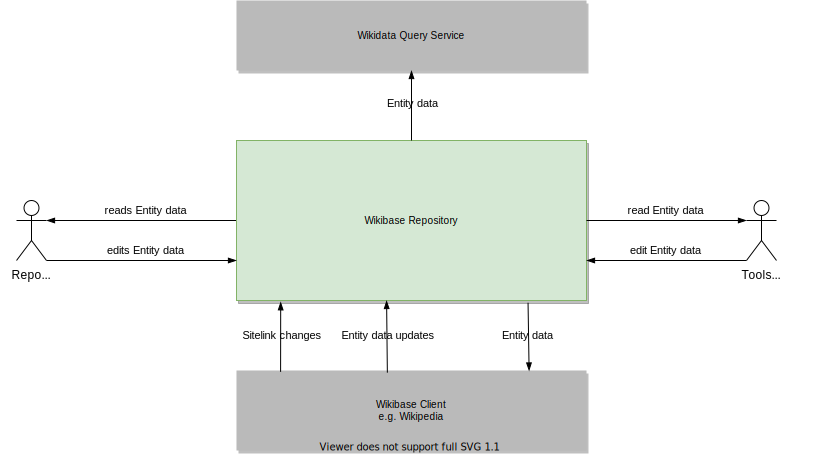

## Context and Scope

### Business Context

| Neighbour              | Description                                                                                                                                                                                   |
| ---------------------- | --------------------------------------------------------------------------------------------------------------------------------------------------------------------------------------------- |
| Tools and Bots         | Applications and [Bots](https://www.mediawiki.org/wiki/Manual:Bots) interacting with the Repo's data programmatically                                                                         |
| Wikibase Client        | Wikibase Clients are [MediaWiki](../../Glossary.md#mediawiki) applications consuming the Wikibase Repository's data. In Wikidata's case these would include Wikipedia, Wiktionary and others. |
| Wikidata Query Service | A SPARQL endpoint and graphical user interface for querying the Repo's data.                                                                                                                  |

### Technical Context

Wikibase Repository is being developed as a set of MediaWiki extensions, but unlike Wikibase Client, they are not "plugins" that live inside MediaWiki, adding functionality to it. Instead, Wikibase Repository should be considered a system of its own, which is reflected in this diagram by not regarding MediaWiki as an external system to Wikibase Repository. See further details on this decision in the [Solution Strategy](04-Solution_Strategy.md#developing-wikibase-repository-through-mediawiki-extensions) section.

::: tip
Note that updates to the Query Service from the Repo will use either Recent Changes or the event stream via EventLogging and EventGate, not both. Wikidata uses the event stream, while most third party Wikibase setups use an updater that polls the Recent Changes page.
:::

| Component                                                                 | Description                                                                                                                                 |
| ------------------------------------------------------------------------- | ------------------------------------------------------------------------------------------------------------------------------------------- |
| Entity UI and Special Pages                                               | These are the main web user interfaces for viewing and editing [Entity](../../Glossary.md#entity) data                                      |
| Dump Generation                                                           | Generates various formats of data dump from the Repo's [Entities](../../Glossary.md#entity)                                                 |
| [MW Recent Changes](https://www.mediawiki.org/wiki/Help:Recent_changes)   | A MediaWiki page listing the most recent edits                                                                                              |
| [MW EventLogging](https://www.mediawiki.org/wiki/Extension:EventLogging)  | Backend-agnostic logs of structured event data                                                                                              |
| [EventGate](https://wikitech.wikimedia.org/wiki/Event_Platform/EventGate) | An EventLogging backend which in production is backed by Kafka                                                                              |
| Repo DB                                                                   | The SQL database containing [Entity](../../Glossary.md#entity) data                                                                         |
| Data Dumps                                                                | Data dump artifacts, in a variety of formats                                                                                                |
| Entity edit hooks                                                         | Hooks that get triggered when an [Entity](../../Glossary.md#entity) is edited                                                               |
| UpdateRepo                                                                | Updates [Sitelinks](../../Glossary.md#sitelink) when the sitelink target is moved or deleted on the Wikibase Client                         |
| API                                                                       | The Repo's actions on the [MW Action API](https://www.mediawiki.org/wiki/API:Main_page) for editing Entities and reading Entity (meta) data |
