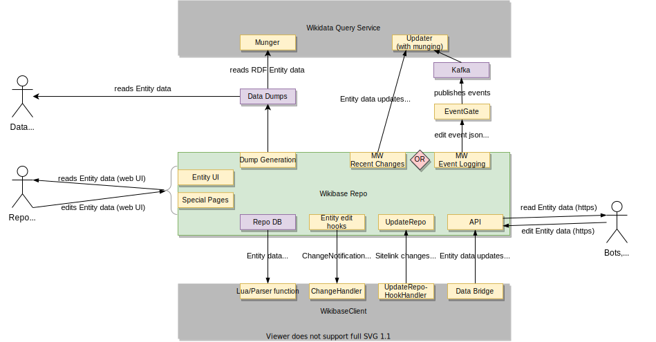

## Context and Scope

### Business Context

| Neighbour              | Description                                                                                                                                                     |
| ---------------------- | --------------------------------------------------------------------------------------------------------------------------------------------------------------- |
| User                   | A user reading or editing the Repo's data through its web interface                                                                                             |
| Tools and Bots         | Applications and [Bots](https://www.mediawiki.org/wiki/Manual:Bots) interacting with the Repo's data programmatically                                           |
| Wikibase Client System | Wikibase Client Systems are MediaWiki applications consuming the Wikibase Repo's data. In Wikidata's case these would include Wikipedia, Wiktionary and others. |
| Wikidata Query Service | A SPARQL endpoint and graphical user interface for querying the Repo's data.                                                                                    |

### Technical Context

::: tip
Note that updates to the Query Service from the Repo will use either Recent Changes or the event stream via EventLogging and EventGate, not both. Wikidata uses the event stream, while most third party Wikibase setups use an updater that polls the Recent Changes page.
:::

| Component                                                                 | Description                                                                                                                                 |
| ------------------------------------------------------------------------- | ------------------------------------------------------------------------------------------------------------------------------------------- |
| Entity UI and Special Pages                                               | These are the main web user interfaces for viewing and editing Entity data                                                                  |
| RdfDumpGenerator                                                          | Generates an RDF file from the Repo's Entities                                                                                              |
| [MW Recent Changes](https://www.mediawiki.org/wiki/Help:Recent_changes)   | A MediaWiki page listing the most recent edits                                                                                              |
| [MW EventLogging](https://www.mediawiki.org/wiki/Extension:EventLogging)  | Backend-agnostic logs of structured event data                                                                                              |
| [EventGate](https://wikitech.wikimedia.org/wiki/Event_Platform/EventGate) | An EventLogging backend which in production is backed by Kafka                                                                              |
| Repo DB                                                                   | The SQL database containing Entity data                                                                                                     |
| Entity edit hooks                                                         | Hooks that get triggered when an Entity is edited                                                                                           |
| UpdateRepo                                                                | Updates sitelinks when the sitelink target is moved or deleted on the Client                                                                |
| API                                                                       | The Repo's actions on the [MW Action API](https://www.mediawiki.org/wiki/API:Main_page) for editing Entities and reading Entity (meta) data |
