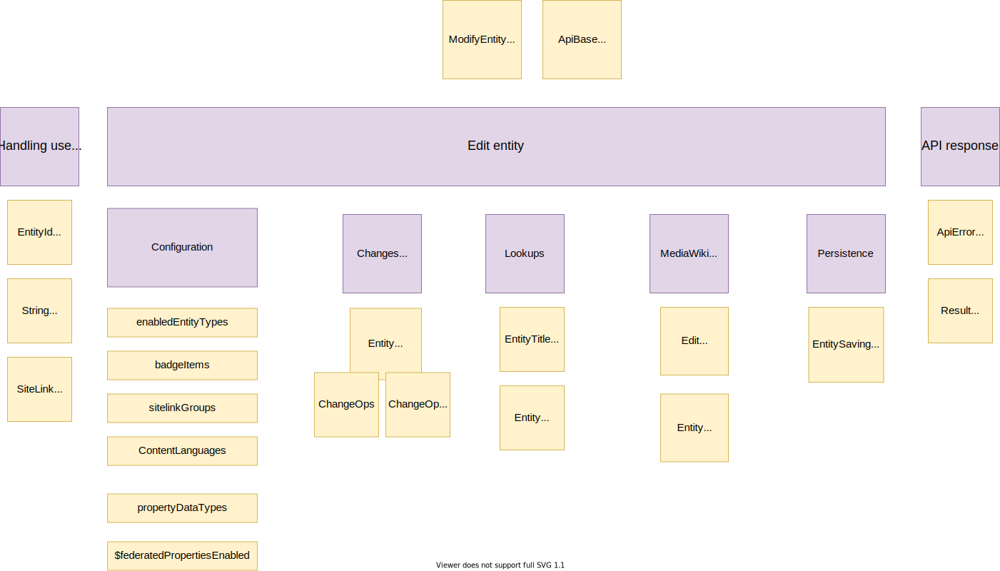

# Building Block View

## Whitebox Overall System

TBA

## Action API modules

| Building Block                          | Responsibility                                                                              |
| --------------------------------------- | ------------------------------------------------------------------------------------------- |
| wbavailablebadges                       | Get available badge items                                                                   |
| wbcreateclaim                           | Create Wikibase claims                                                                      |
| wbcreateredirect                        | Create Entity redirects                                                                     |
| [wbeditentity](#action-api-edit-entity) | Create a single new Wikibase entity and modifies it with serialised information             |
| wbformatentities                        | Format entity IDs to HTML                                                                   |
| wbformatvalue                           | Format DataValues                                                                           |
| wbgetclaims                             | Get Wikibase claims                                                                         |
| wbgetentities                           | Get the data for multiple Wikibase entities                                                 |
| wblinktitles                            | Associate two pages on two different wikis with a Wikibase item                             |
| [wbmergeitems](#action-api-merge-items) | Merge multiple items                                                                        |
| wbparsevalue                            | Parse values using a ValueParser                                                            |
| wbremoveclaims                          | Remove Wikibase claims                                                                      |
| wbremovequalifiers                      | Remove a qualifier from a claim                                                             |
| wbremovereferences                      | Remove one or more references of the same statement                                         |
| wbsearchentities                        | Search for entities using labels and aliases                                                |
| wbsetaliases                            | Set the aliases for a Wikibase entity                                                       |
| wbsetclaim                              | Create or updates an entire Statement or Claim                                              |
| wbsetclaimvalue                         | Set the value of a Wikibase claim                                                           |
| wbsetdescription                        | Set a description for a single Wikibase entity                                              |
| wbsetlabel                              | Set a label for a single Wikibase entity                                                    |
| wbsetqualifier                          | Create a qualifier or sets the value of an existing one                                     |
| wbsetreference                          | Create a reference or sets the value of an existing one                                     |
| wbsetsitelink                           | Associate a page on a wiki with a Wikibase item or removes an already made such association |

### [Action API Edit Entity](https://www.wikidata.org/w/api.php?action=help&modules=wbeditentity)

| Building Block                         | Type/Context                  | Responsibility                                                                                                                                                                                               |
| -------------------------------------- | ----------------------------- | ------------------------------------------------------------------------------------------------------------------------------------------------------------------------------------------------------------ |
| ModifyEntity                           | base class                    | Base class for API modules modifying a single entity                                                                                                                                                         |
| EntityIdParser                         | Handling user input           | Transforms strings into EntityId objects                                                                                                                                                                     |
| StringNormalizer                       | Handling user input           | Normalizes strings                                                                                                                                                                                           |
| SiteLinkTargetProvider                 | Handling user input           | Returns the list of sites that is suitable as a sitelink target                                                                                                                                              |
| EntityChangeOpProvider                 | Changes applied to the entity | Turns entity change request into ChangeOp objects based on change request deserialization configured for the particular entity type                                                                          |
| ChangeOpDeserializers                  | Changes applied to the entity | ChangeOpDeserializers for fields of items and properties, such as label, description, alias, claim and sitelink                                                                                              |
| ChangeOps                              | Changes applied to the entity | Class for holding a batch of change operations                                                                                                                                                               |
| EntityTitleLookup                      | lookups                       | Represents an arbitrary mapping from entity IDs to wiki page titles, with no further guarantees given. The resulting title does not necessarily represent the page that actually stores the entity contents. |
| EntityRevisionLookup                   | lookups                       | Service interface for retrieving EntityRevisions from storage                                                                                                                                                |
| EditSummaryHelper                      | MediaWiki binding             | Helper methods for preparing summary instance for editing entity activity                                                                                                                                    |
| EntityPermissionChecker                | MediaWiki binding             | Service interface for checking a user's permissions on a given entity.                                                                                                                                       |
| EntitySavingHelper/EntityLoadingHelper | persistence                   | Helper classes for api modules to save and load entities.                                                                                                                                                    |
| ApiErrorReporter                       | API response                  | A component for API modules that handles error reporting                                                                                                                                                     |
| ResultBuilder                          | API response                  | Builder of MediaWiki ApiResult objects with various convenience functions for adding Wikibase concepts and result parts to results in a uniform way                                                          |

### [Action API Merge Items](https://www.wikidata.org/w/api.php?action=help&modules=wbmergeitems)

| Building Block                              | Type/Context        | Responsibility                                                                                                                                      |
| ------------------------------------------- | ------------------- | --------------------------------------------------------------------------------------------------------------------------------------------------- |
| ApiBase                                     | base class          | Base class for MediaWiki Action API modules                                                                                                         |
| EntityIdParser                              | Handling user input | Transforms strings into EntityId objects                                                                                                            |
| [ItemMergeInteractor](#itemmergeinteractor) | Processing          | Performs an Item merge                                                                                                                              |
| ApiErrorReporter                            | API response        | A component for API modules that handles error reporting                                                                                            |
| ResultBuilder                               | API response        | Builder of MediaWiki ApiResult objects with various convenience functions for adding Wikibase concepts and result parts to results in a uniform way |

## Special Pages

### Special Merge Items

| Building Block                              | Type/Context        | Responsibility                                                                                                                                                                                               |
| ------------------------------------------- | ------------------- | ------------------------------------------------------------------------------------------------------------------------------------------------------------------------------------------------------------ |
| SpecialWikibasePage                         | base class          | Base class for Wikibase [Special Pages](../overview/12-Glossary.md#special-page)                                                                                                                             |
| EntityIdParser                              | Handling user input | Transforms strings into EntityId objects                                                                                                                                                                     |
| TokenCheckInteractor                        | Handling user input | Checks a submitted edit token                                                                                                                                                                                |
| [ItemMergeInteractor](#itemmergeinteractor) | Processing          | Performs an Item merge                                                                                                                                                                                       |
| EntityTitleLookup                           | API response        | Represents an arbitrary mapping from entity IDs to wiki page titles, with no further guarantees given. The resulting title does not necessarily represent the page that actually stores the entity contents. |
| ExceptionLocalizer                          | API response        | Provide localized messages for some types of Exceptions                                                                                                                                                      |

## Interactors

### ItemMergeInteractor

| Building Block                                                        | Type/Context                  | Responsibility                                                                                                                                                                                                                                                |
| --------------------------------------------------------------------- | ----------------------------- | ------------------------------------------------------------------------------------------------------------------------------------------------------------------------------------------------------------------------------------------------------------- |
| MergeFactory                                                          | Changes applied to the entity | Factory for merging services                                                                                                                                                                                                                                  |
| [EntityRedirectCreationInteractor](#entityredirectcreationinteractor) | Changes applied to the entity | Performs an Entity redirect creation                                                                                                                                                                                                                          |
| EntityRevisionLookup                                                  | lookups                       | Service interface for retrieving EntityRevisions from storage                                                                                                                                                                                                 |
| EntityTitleStoreLookup                                                | lookups                       | Represents a mapping from entity IDs to wiki page titles, assuming that the resulting title represents a page that actually stores the entity contents. For example, the property P1 will be resolved to the "Property" namespace and the page "Property:P1". |
| SummaryFormatter                                                      | MediaWiki binding             | Formats Wikibase Summary objects to strings for MediaWiki                                                                                                                                                                                                     |
| EntityPermissionChecker                                               | MediaWiki binding             | Service interface for checking a user's permissions on a given entity.                                                                                                                                                                                        |
| PermissionManager                                                     | MediaWiki binding             | A MediaWiki service class for checking permissions                                                                                                                                                                                                            |
| EntityStore                                                           | Persistence                   | Storage interface for Entities                                                                                                                                                                                                                                |

### EntityRedirectCreationInteractor

| Building Block          | Type/Context      | Responsibility                                                                                                                                                                                                                                                |
| ----------------------- | ----------------- | ------------------------------------------------------------------------------------------------------------------------------------------------------------------------------------------------------------------------------------------------------------- |
| EntityRevisionLookup    | lookups           | Service interface for retrieving EntityRevisions from storage                                                                                                                                                                                                 |
| EntityTitleStoreLookup  | lookups           | Represents a mapping from entity IDs to wiki page titles, assuming that the resulting title represents a page that actually stores the entity contents. For example, the property P1 will be resolved to the "Property" namespace and the page "Property:P1". |
| EntityRedirectLookup    | lookups           | Service interface for retrieving information about entity redirects.                                                                                                                                                                                          |
| SummaryFormatter        | MediaWiki binding | Formats Wikibase Summary objects to strings for MediaWiki                                                                                                                                                                                                     |
| EntityPermissionChecker | MediaWiki binding | Service interface for checking a user's permissions on a given entity.                                                                                                                                                                                        |
| EditFilterHookRunner    | MediaWiki binding | Runs the MediaWiki EditFilter hook                                                                                                                                                                                                                            |
| EntityStore             | Persistence       | Storage interface for Entities                                                                                                                                                                                                                                |
