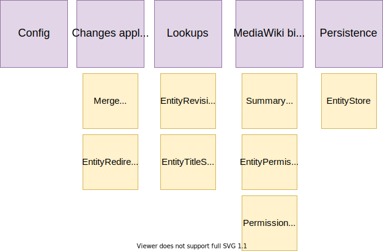
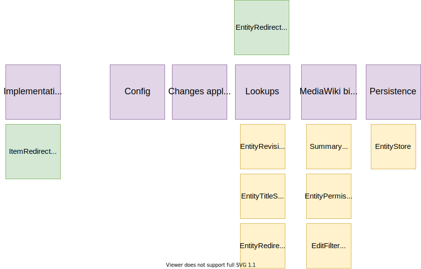

# Building Block View

## Whitebox Overall System

TBA

### External Interfaces

#### Action API Edit Entity

|  Building Block | Type/Context  | Responsibility   |
| ------------ | ------------ | ------------ |
| ModifyEntity   |  base class | Base class for API modules modifying a single entity  |
| EntityIdParser | Handling user input | Interface for objects that can parse strings into EntityIds  |
| StringNormalizer  | Handling user input   | Normalizes strings  |
| SiteLinkTargetProvider  | Handling user input  |  Returns the list of sites that is suitable as a sitelink target |
| enabledEntityTypes  | configuration | List of entity type identifiers (typically "item" and "property") that are configured in WikibaseRepo.entitytypes.php  |
| badgeItems  | configuration | Items allowed to be used as badges  |
| sitelinkGroups  | configuration | The site groups to use in sitelinks  |
| ContentLanguages  | configuration | A list of languages supported as content language  |
| propertyDataTypes  | configuration |  A list of property data types |
| $federatedPropertiesEnabled  | configuration | Is federated properties enabled on the wikibase  |
| EntityChangeOpProvider  | Changes applied to the entity | Turns entity change request into ChangeOp objects based on change request deserialization configured for the particular entity type  |
|  ChangeOpDeserializers | Changes applied to the entity | ChangeOpDeserializers for fields of items and properties, such as label, description, alias, claim and sitelink  |
|  ChangeOps | Changes applied to the entity | Class for holding a batch of change operations  |
| TitleLookup  | lookups |   Represents an arbitrary mapping from entity IDs to wiki page titles, with no further guarantees given. The resulting title does not necessarily represent the page that actually stores the entity contents. |
| EntityTitleStoreLookup  | lookups | Represents a mapping from entity IDs to wiki page titles, assuming that the resulting title represents a page that actually stores the entity contents. For example, the property P1 will be resolved to the "Property" namespace and the page "Property:P1".  |
|  EntityRevisionLookup | lookups | Service interface for retrieving EntityRevisions from storage |
|  EditSummaryHelper | MediaWiki binding | Helper methods for preparing summary instance for editing entity activity  |
| EntityPermissionChecker  | MediaWiki binding | Service interface for checking a user's permissions on a given entity.  |
|  EntitySavingHelper/EntityLoadingHelper | persistence | Helper classes for api modules to save and load entities.  |
| ApiErrorReporter  | API response | A component for API modules that handles error reporting  |
| ResultBuilder  | API response | Builder of MediaWiki ApiResult objects with various convenience functions for adding Wikibase concepts and result parts to results in a uniform way |

#### Action API Merge Items

#### Special Merge Items

### Interactors

#### ItemMergeInteractor

#### EntityRedirectCreationInteractor

