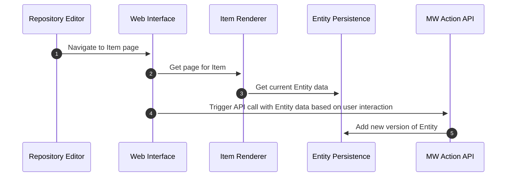

# Runtime View

## Basic Editing on Wikidata

see the [Wikidata editor's use case](./01-Introduction_and_Goals.md#repository-editor): _Edit existing structured entity data on a Repository via a desktop web interface_

## Runtime Scenario 2

## Runtime Scenario 3

...
