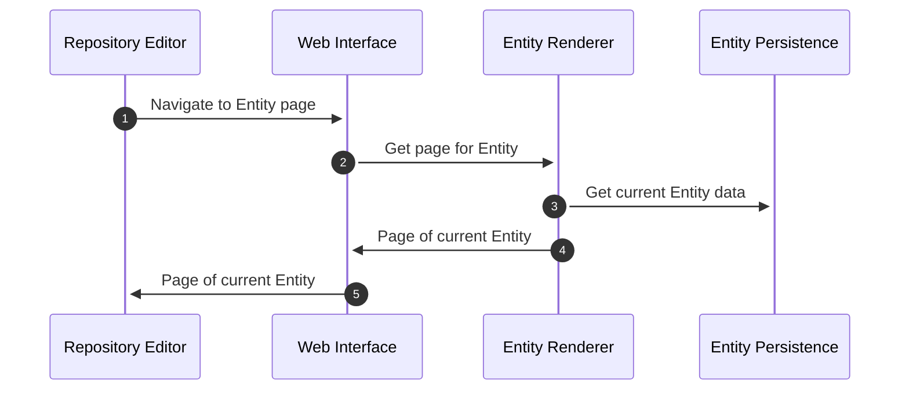
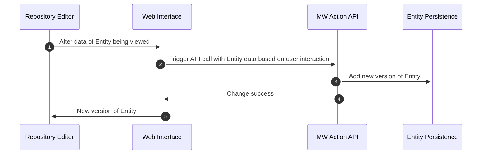
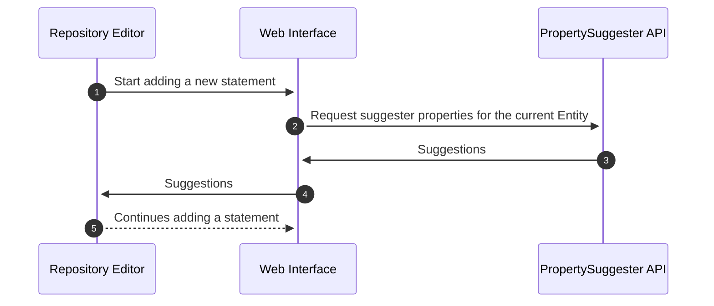

# Runtime View

## Basic Viewing on a Repository

See the [editor's use case](./01-Introduction_and_Goals.md#editor): _View structured entity data on devices of varying capabilities (including mobile)._

## Basic JS Editing on a Repository

See the [editor's use case](./01-Introduction_and_Goals.md#editor): _Interact with (CRUD) structured entity datain a repository via a desktop web interface._

## User suggested a property when adding a statement

See the [editor's use case](./01-Introduction_and_Goals.md#editor): _Receive suggestions for [properties](../../Glossary.md#property) in a meaningful order when trying to add new [statements](../../Glossary.md#statement)._

