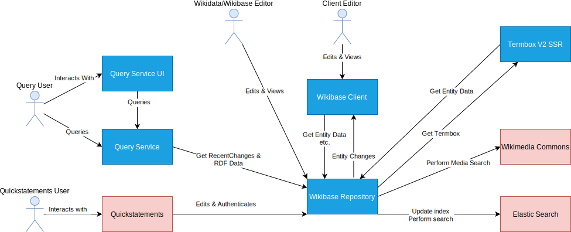

# Building Block View

## Whitebox Overall System

| Building Block                        | Responsibility                                                |
| ------------------------------------- | ------------------------------------------------------------- |
| [WikibaseRepo](./../WikibaseRepo)     | Data Repository                                               |
| [WikibaseClient](./../WikibaseClient) | Access view MediaWiki to a Data Repository                    |
| Query Service                         | Graph representation of Wikibase data with a SPARQL interface |
| Query Service UI                      | User interface for a SPARQL interface                         |
| Elastic Search                        | Indexes MediaWiki / Wikibase for search pourposes             |
| Wikimedia Commons                     | A source of media files for Wikibase                          |
| Quickstatements                       | A tool enabling mass editing of Wikibase Entities             |
